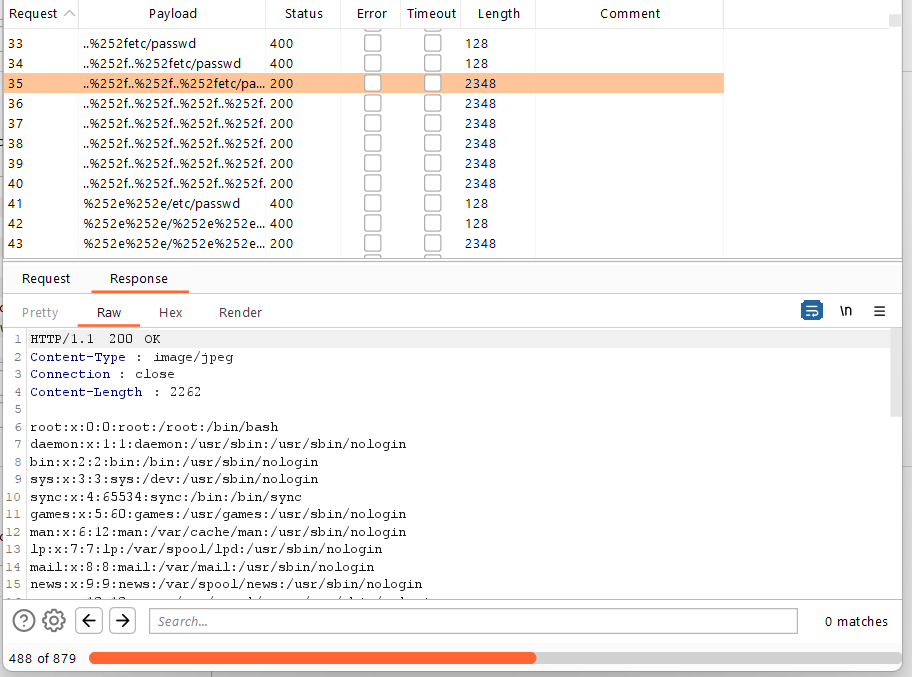

## File path traversal, traversal sequences stripped with superfluous URL-decode

1. Theo đề bài, lab có lỗ hổng directory traversal trong url ảnh của product. Tuy nhiên lab đã chặn input chứa các sequence ``../`` và mã hóa.

2. Gửi request vào Burp Intruder, sử dụng path traversal payload list thử {FILE} = etc/passwd 

