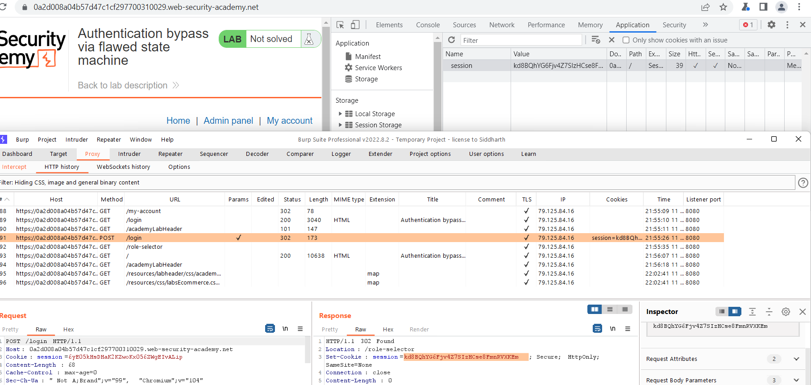

## Authentication bypass via flawed state machine (REFER)

1. Với thao tác đăng nhập thông thường, người dùng sau khi nhập đúng thông tin đăng nhập sẽ được redirect sang path ``/role-selector``. 

2. Bypass tiến trình chọn role bằng cách bật ``Intercept`` trên BurpProxy rồi lấy cookie được set sau khi điền thông tin đăng nhập sửa cookie trên home page thì nhận thấy role mặc định là admin.

3. Vào admin panel xóa ``carlos`` user.