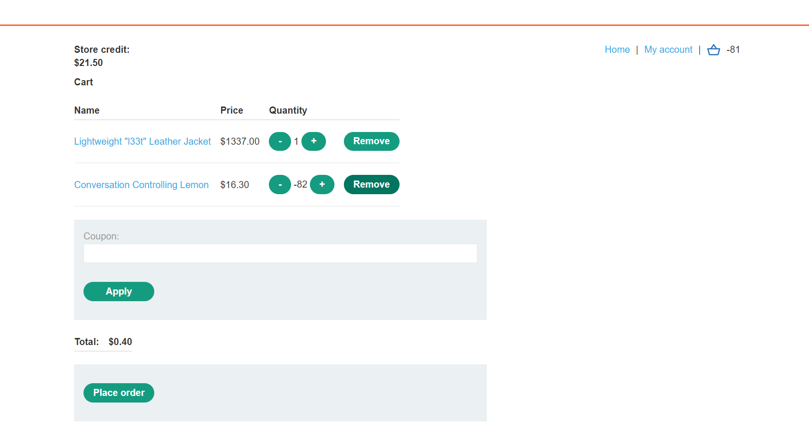

## High-level logic vulnerablity

1. Đặt sản phẩm cần mua vào giỏ hàng, nhận thấy trong ``POST /cart`` request ta có thể thay đổi số lượng sản phẩm về giá trị âm.

2. Thêm 1 sản phẩm bất kỳ có giá nhỏ hơn tài khoản hiện có, ước lượng số lượng hợp lý để cả giỏ hàng có tổng giá trị dương

3. Tại ``Repeater`` sửa giá trị số lượng sản phẩm thành giá trị âm tương ứng 

4. Reload lại trang giỏ hàng nhận thấy tổng giá trị của giỏ đang lớn hơn 0, ``Place order`` để hoàn thành

