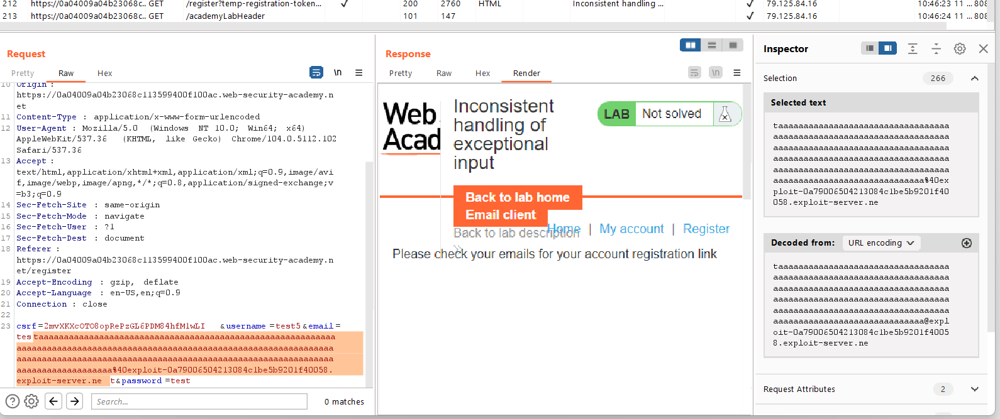
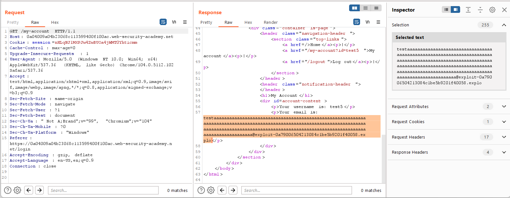
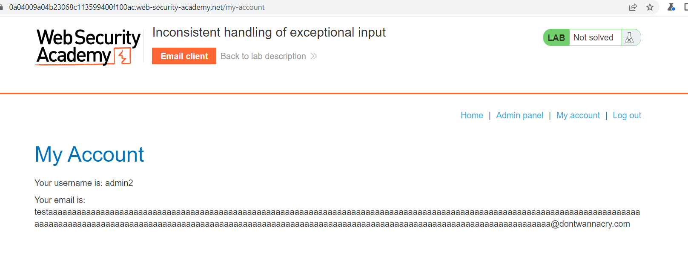

## Inconsistent handling of exceptional input

1. Nhận thấy chỉ những người dùng có email ``@dontwannacry`` mới có quyền admin

2. Thử đăng ký với email có độ dài rất lớn thì nhận thấy vẫn nhận được email xác thực.

3. Nhưng email sau khi đăng nhập thì chỉ còn 255 ký tự đầu.

4. Từ đó ta có thể thêm payload với phần trước @ trong email đủ dài để email sau khi đăng ký chỉ còn phần subdomain ``@dontwannacry``

5. Vào admin panel xóa tài khoản carlos