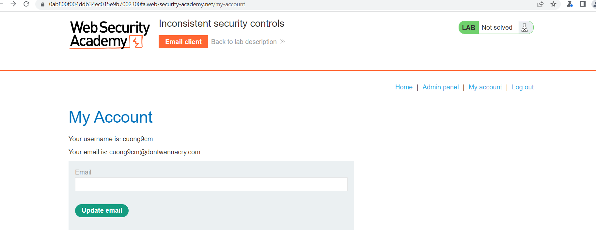

## Inconsistent security controls

1. Nhận thấy để đăng ký account trong lab này, ta sẽ phải submit email có đuôi ``@exploit-0abf001e0471b30cc0b2ebaa01c70009.exploit-server.net`` để có thể hoàn thành đăng ký và email của nhân viên công ty sẽ có đuôi là ``@dontwannacry.com`` 

2. Sau khi đăng nhập ta update email thành đuôi ``@dontwannacry.com`` thì account của t đã lên quyền admin. Vào admin panel xóa ``carlos`` user.

