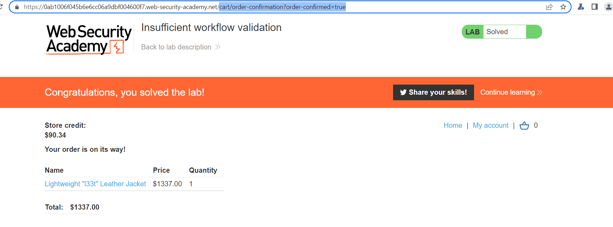

## Insufficient workflow validation

1. Thử mua một mặt hàng hợp lệ, nhận thấy sau khi place order thì ta sẽ được redirect sang path ``/cart/order-confirmation?order-confirmed=true``.

2. Đặt mẫu jacket cần mua vào giỏ hàng sau khi ấn place order thì sửa path lỗi thành ``/cart/order-confirmation?order-confirmed=true``

