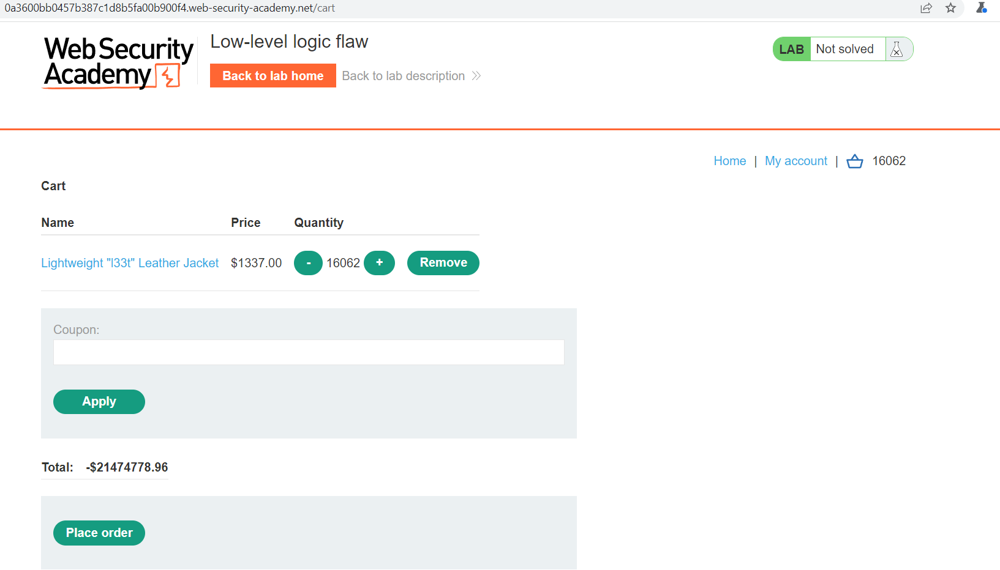
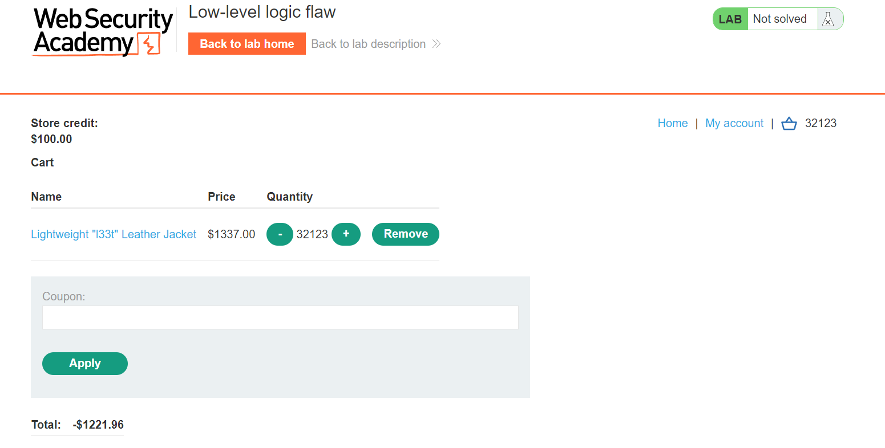
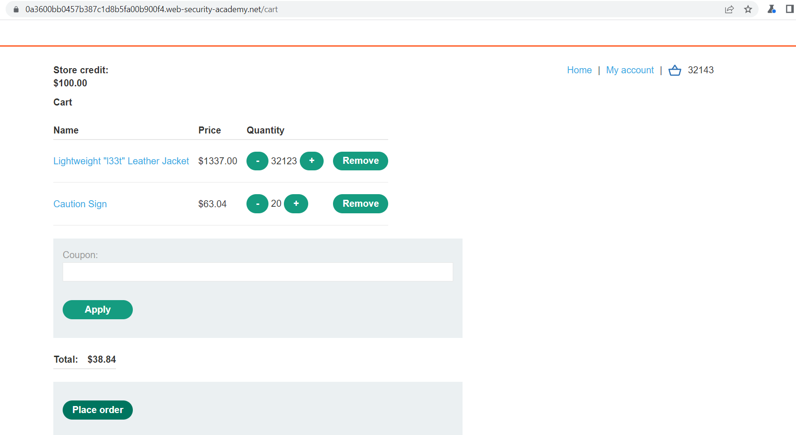

## Low-level logic flaw

1. Nhận thấy khi thử đặt với 1 giá trị quá lớn vượt quá giới hạn kiểu dữ liệu của ngôn ngữ lab dùng thì tổng giá trị giỏ hàng sẽ chuyển sang giá trị âm.

2. Thử đặt hàng với số lượng hàng phù hợp với các giá trị lớn nhất của các kiểu dữ liệu có thể như 2^15, 2^31, 2^63,...

3. Nhận thấy với số lượng ``16062`` tổng giá trị giỏ hàng được chuyển về số âm 

4. Từ đó suy ra kiểu dữ liệu sử dụng có thể chứa các giá trị từ ``-2^31 -> 2^31``. Nâng số lượng lên gấp đôi. Với ``32123`` cái jacket thì tổng giỏ hàng sẽ là ``-$1221.96`` còn với ``32124`` thì sẽ là ``$115.04`` đều không đủ điều kiện mua.

5. Lấy ``32123`` cái jacket và 1 sản phẩm khác có giá dưới $100 với số lượng hợp lý.

