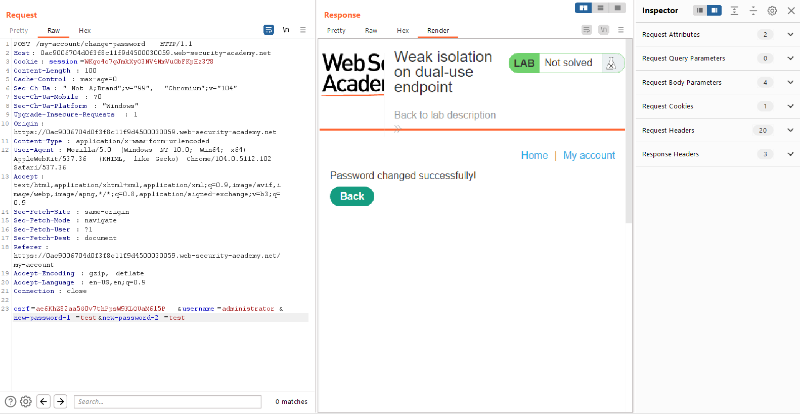

## Weak isolation on dual-use endpoint

1. Đăng nhập vào tài khoản ``wiener:peter``, thử chức năng đổi mật khẩu.

2. Nhận thấy khi xóa đi param ``current-password`` nhưng chức năng vẫn hoạt động bình thường.

3. Gửi request mới với username = ``administrator`` 

4. Đăng nhập vào tài khoản ``administrator:test`` xóa user ``carlos``