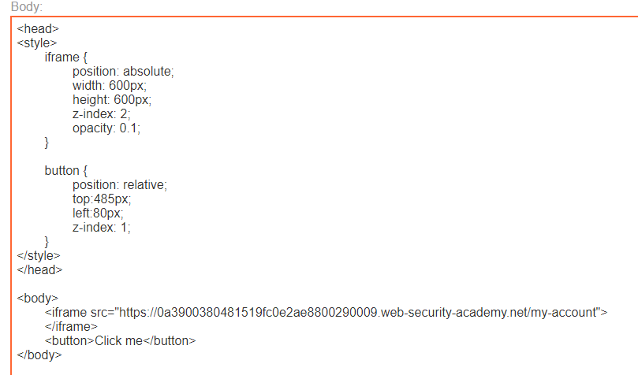

## Basic clickjacking with CSRF token protection

1. Craft trang exploit để thẻ iframe nằm trên button có nội dung là `Click me` để khi victim bấm Click me thì thực chất là bấm vào button delete account trên iframe, đồng thời set opacity thấp để victim không nhìn thấy iframe.

2. Kết quả khi người dùng bấm vào button click me thì account hiện tại sẽ bị xóa