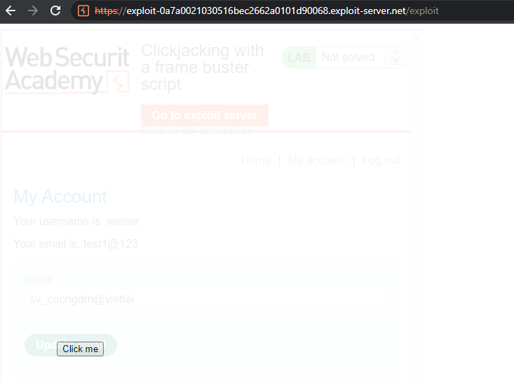

## Clickjacking with a frame buster script

1. Tạo pre-fill input email bằng parameter trên url
- Payload: ```https://0a4600be035afb51c25a185200860016.web-security-academy.net/my-account?email=svcuongdm@viettel```

2. Khi tạo khung iframe trên trang exploit thì nhận được response báo `This page cannot be framed`

3. Bypass frame buster bằng attribute sandbox trong thẻ iframe. Sử dụng giá trị `allow-same-origin` để cho phép iframe được show ra như nguyên bản và `allow-forms` cho phép iframe gửi forms
- Payload: ```<iframe sandbox="allow-same-origin allow-forms" src="https://0aa000a6031a1643c2ab2b38006700e9.web-security-academy.net/my-account?email=sv_cuongdm@viettel">```

4. Cho iframe layer lên trước và chỉnh để button `Click me` và button update email khớp nhau, đồng thời set opacity thấp để victim không nhìn thấy iframe.

