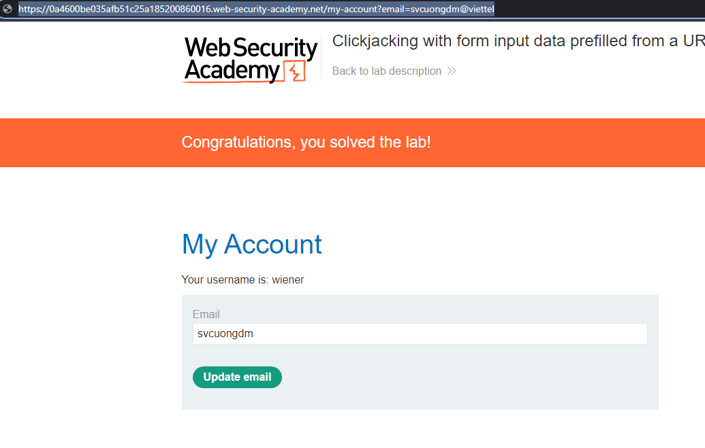
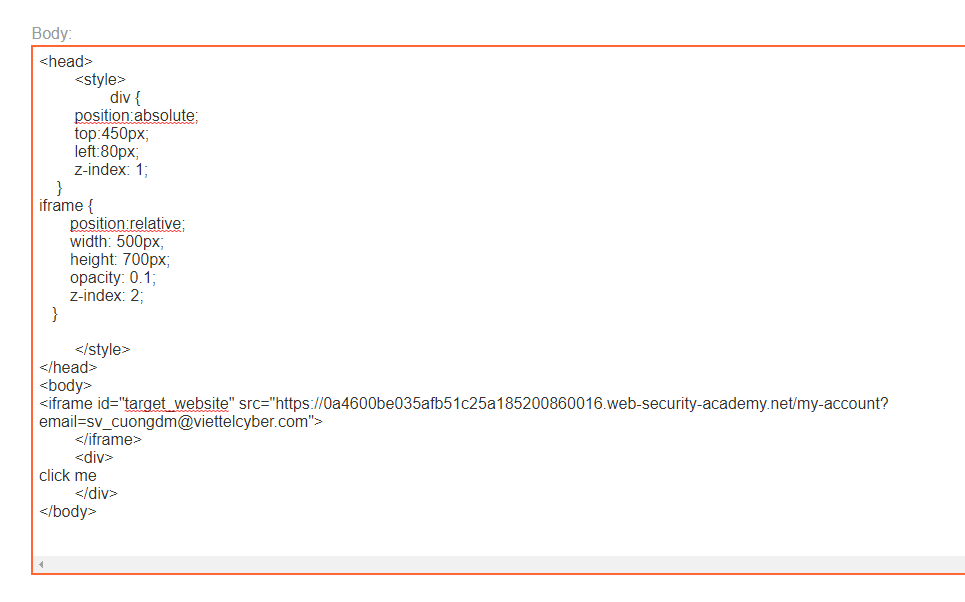
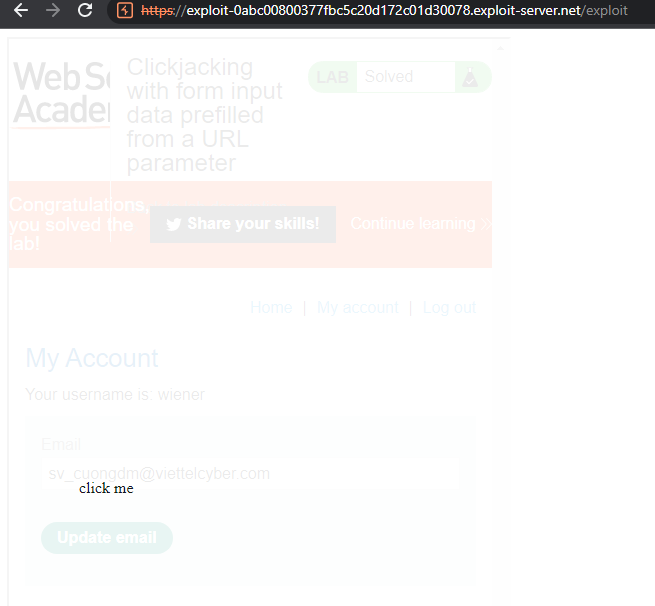

## Clickjacking with form input data prefilled from a URL parameter

1. Theo đề bài, thử tạo pre-fill input email bằng parameter trên url
- Payload: ```https://0a4600be035afb51c25a185200860016.web-security-academy.net/my-account?email=svcuongdm@viettel```



2. Craft trang exploit để thẻ iframe nằm trên thẻ div có nội dung là `Click me` để khi victim bấm Click me thì thực chất là bấm vào button update email trên iframe, đồng thời set opacity thấp để victim không nhìn thấy iframe.



3. Kết quả là:

