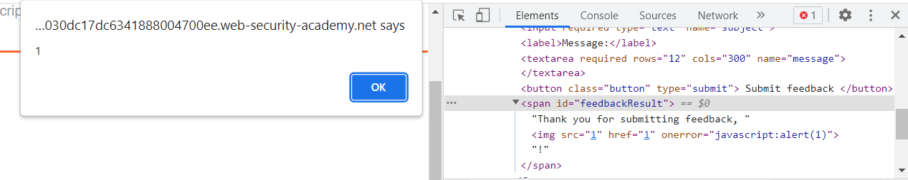
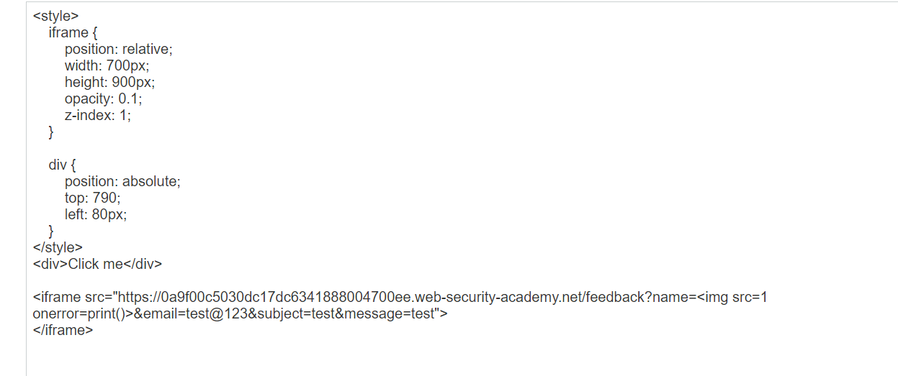

## Exploiting clickjacking vulnerability to trigger DOM-based XSS

1. Ở trang feedback, khi điền form xong sẽ có message ``Thank you for submitting feedback, {name}!``. Khi thử với input ``<script>alert(1)</script>`` thì nhận thấy trang reflect lại y nguyên input mà không có HTML encode -> Do đó có thể khai thác xss được
- Payload: ``````


2. Custom xss để khi click vào thẻ span sẽ gọi lệnh print
- Payload: ```<button onclick="javascript:print()">click</button>```

3. Custom prefill url param với giá trị tham số name là payload trên và các trường required với giá trị bất kỳ.
- URL : ``https://0a9f00c5030dc17dc6341888004700ee.web-security-academy.net/feedback?name=%3Cimg%20src=1%20href=1%20onerror=%22print()%22/%3E&email=test@viettel&subject=math&message=test``

4. Craft trang exploit để khi click vào `click me` thực chất là victim bấm vào submit feedback đã điền sẵn và reflect xss thực hiện câu lệnh script mong muốn

