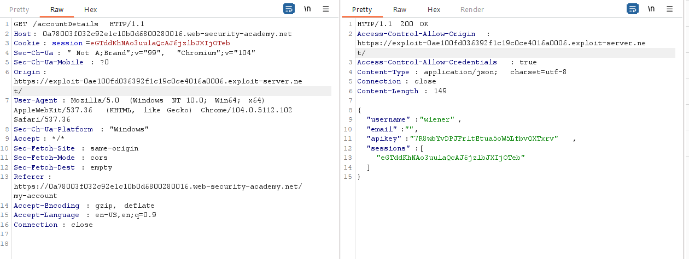
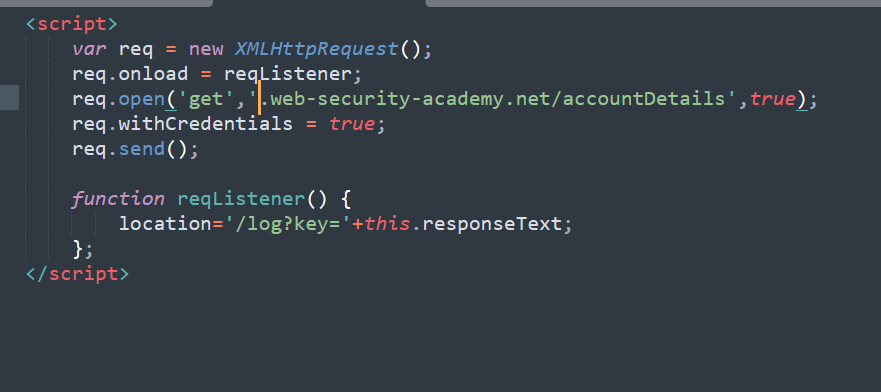

## CORS vulnerability with basic origin reflection (REFER)

1. Sau khi đăng nhập nhận thấy đoạn script để lấy apikey được fetch từ trang `/accountDetails`. Ngoài ra có thể nhận thấy site sử dụng CORS để kiểm soát truy cập 

2. Gửi endpoint `/accountDetails` vào repeater thêm thử origin header bất kỳ thì thấy xuất hiện `ACAO` header reflect y như origin header.

3. Craft trang exploit sử dụng xhr request đến `accountDetails`.

4. Truy xuất accesslog nhận được request chứa param key có apikey.