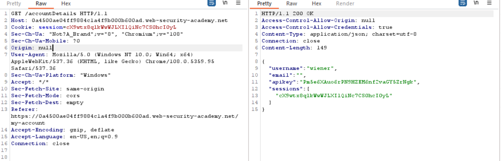
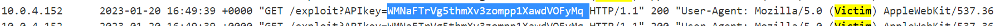

## CORS vulnerability with trusted null origin

1. Theo đề bài, nhận thấy chỉ các origin khác đều không được chấp nhận ngoại trừ giá trị `null`

2. Để tạo một xhr request với origin header = `null` ta sẽ dùng sandboxed iframe.

3. Crart trang exploit thành:

[Exploit Page](\asset/../exploit.html)

4. Gửi cho victim, vào accesslog lấy apikey

