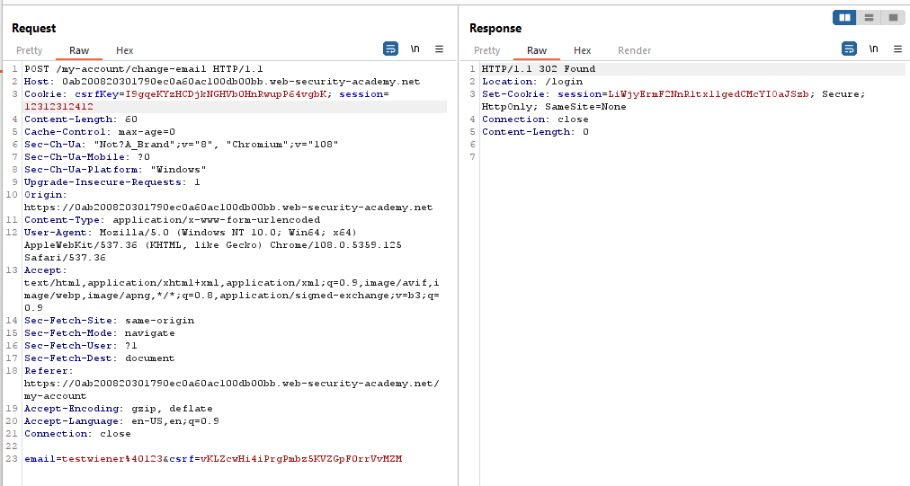
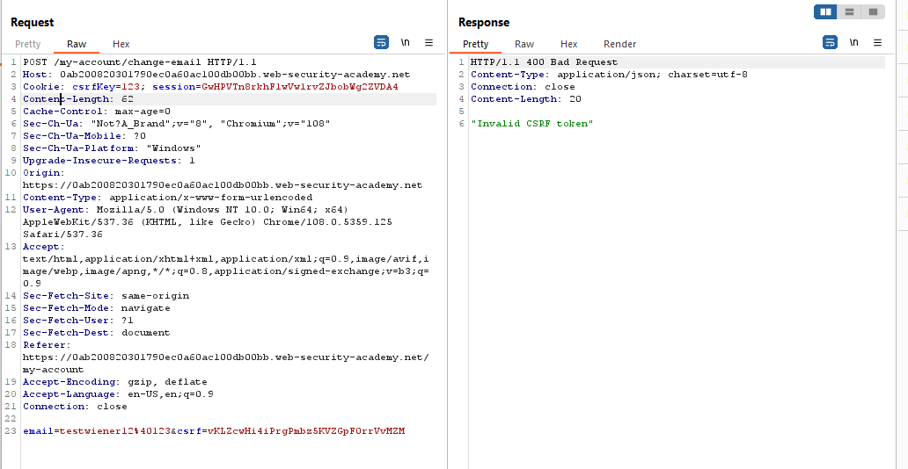
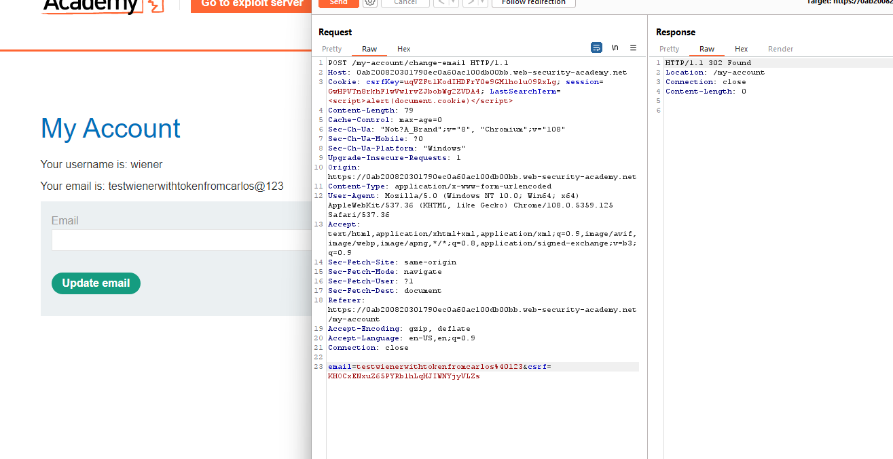
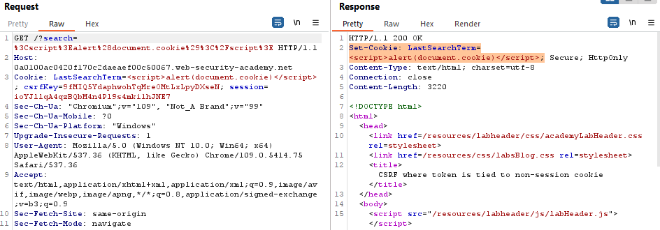
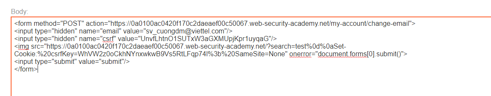

## CSRF where token is tied to non-session cookie (REFER)

1. Nhận thấy trong lab này có một đối tượng mới là `csrfKey`.

2. Chuyển sang Repeater thực hiện một số điều chỉnh nhận thấy.
- Khi đổi giá trị session cookie thành sai thì sẽ bị logout



-  Khi đổi giá trị của csrfkey  cookie và csrf token thành sai thì sẽ chỉ bị từ chối mà không bị logout 



3. Từ đó có thể thấy session cookie và csrfkey cookie không được link với nhau. 

4. Lấy giá trị csrfkey, csrf token của carlos gán cho session wiener thì nhận thấy đổi email cho wiener thành công.



5. Để ý thấy trong request header có thêm trường cookie `LastSearchTerm` lưu lại input search gần nhất. Nhập input vào thì thấy trong response sẽ trả về có header `Set-Cookie` có thể bypass.



- Payload: ```/?search=test%0d%0aSet-Cookie:%20csrfKey=FiBAgGdhKwBK5Hz5fW5tQ7U0Z6grIIzG%3b%20SameSite=None```

6. Set thành công csrfkey cookie thì ô search. 
-> craft trang exploit

