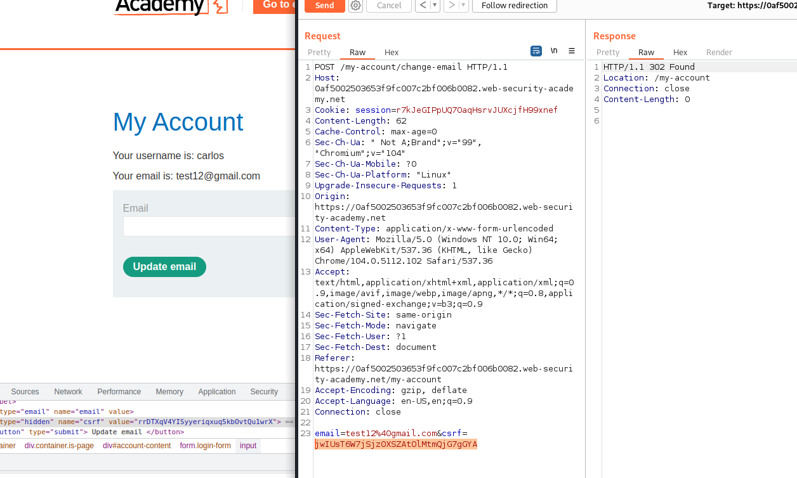
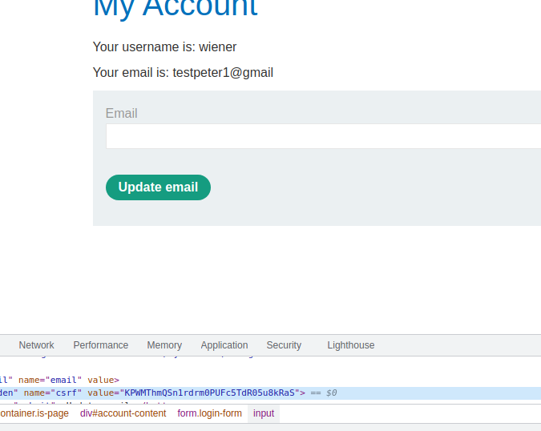
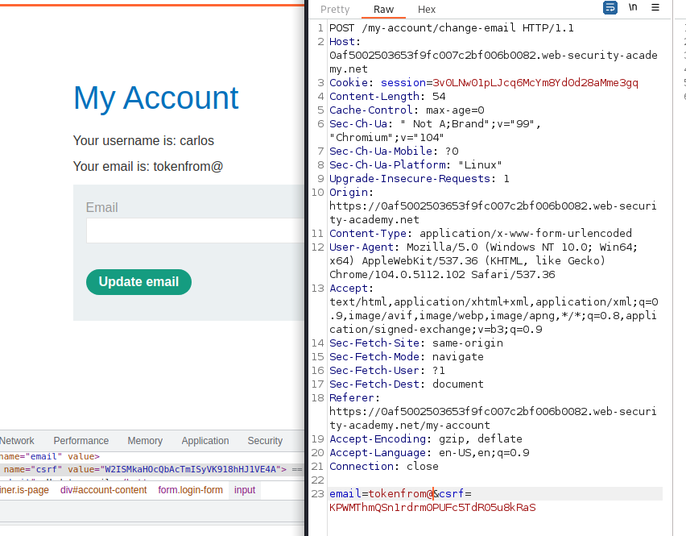
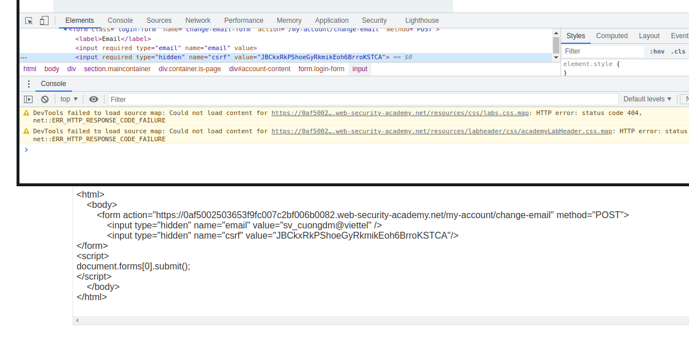

## CSRF where token is not tied to user session

1. Nhận thấy mỗi lần ta đổi email thì web sẽ generate ra một csrf token khác.

2. Khi xem source code nhận thấy trong form `change-email` có thẻ input hidden chứa giá trị của csrf token. Tạo một request `change-email` mới với giá trị csrf này thì thành công.

3. Theo đề bài, giá trị token sẽ không liên quan đến user session. Ta sẽ thử gửi request `change-email` mới với giá trị csrf của tài khoản `wiener` với sesion cookie của tài khoản `carlos`.

-> Change email thành công 

4. Tạo một form điền giá trị csrf hiện của `carlos` vào param `csrf` trong trang exploit.

