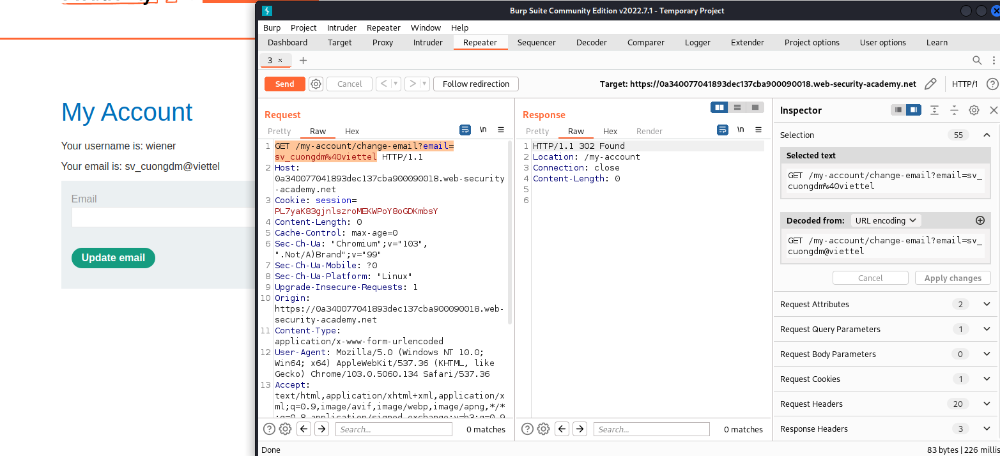
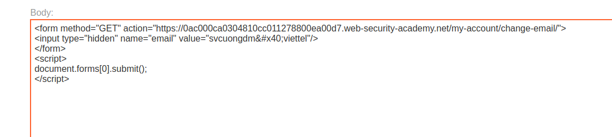

## CSRF where token validation depends on request method

1. Theo gợi ý từ đề bài, csrf token sẽ dựa theo request method. Thử với những method khác

2. Nhận thấy với method GET với request ``GET /my-account/change-email?email={email_attacker}`` thì chức năng vẫn hoạt động

3. Dựa vào đó ta tạo một form method `GET` tới trang target với param `email` có giá trị mà ta muốn đổi trong trang exploit.

4. Gửi đến victim