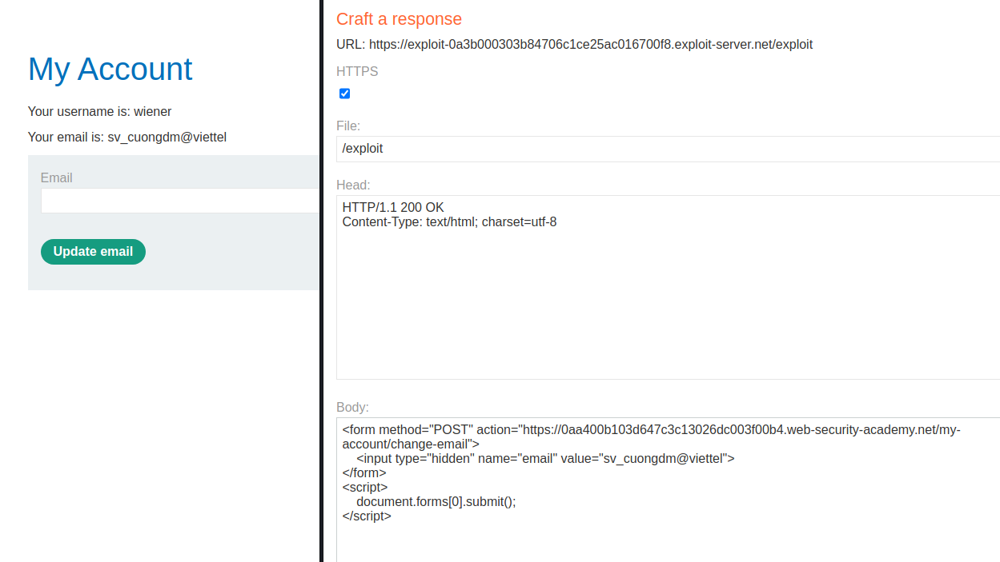

## CSRF where token validation depends on token being present

1. Login vào account `wiener:peter`, thử chức năng thay đổi email. Nhận thấy dù param csrf để trống thì chức năng vẫn hoạt động bình thường.

2. Tạo form mà khi victim truy cập vào tự động gửi request cùng với sesion cookie của victim với email của attacker.

3. Gửi trang exploit đến nạn nhân