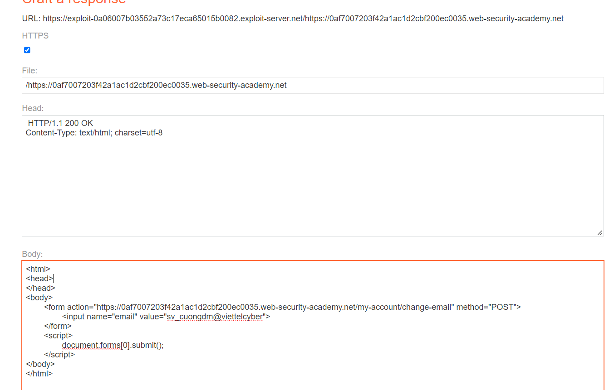
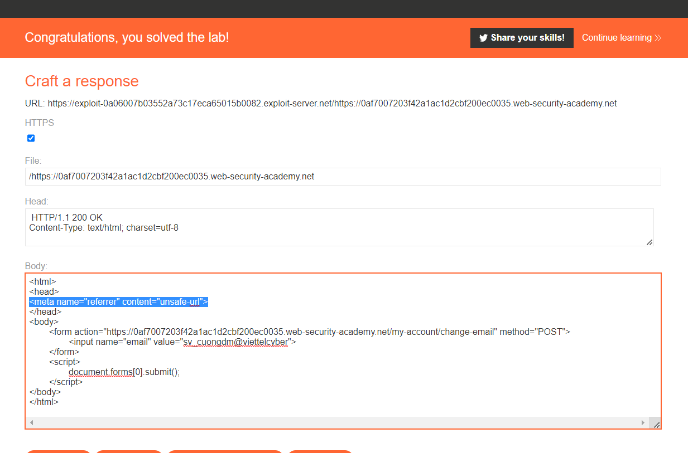

## CSRF with broken Referer validation

1. Login vào account được cấp, đổi email. Craft trang exploit nhận thấy lab này khi không có referer hay không cùng host thì đều không hợp lệ

2. Thử với giá trị referer có chứa trang host ``https://exploit-0a06007b03552a73c17eca65015b0082.exploit-server.net/0af7007203f42a1ac1d2cbf200ec0035.web-security-academy.net`` thì thấy thành công

3. Để referer có giá trị mong muốn như trên ta sẽ craft url trang exploit của mình thành 

4. Nhận thấy trường referer vẫn không hợp lệ. Bypass bằng cách set referer-policy thành giá trị `unsafe-url`. Khai báo thẻ meta `<meta name="referrer" content="unsafe-url">`

