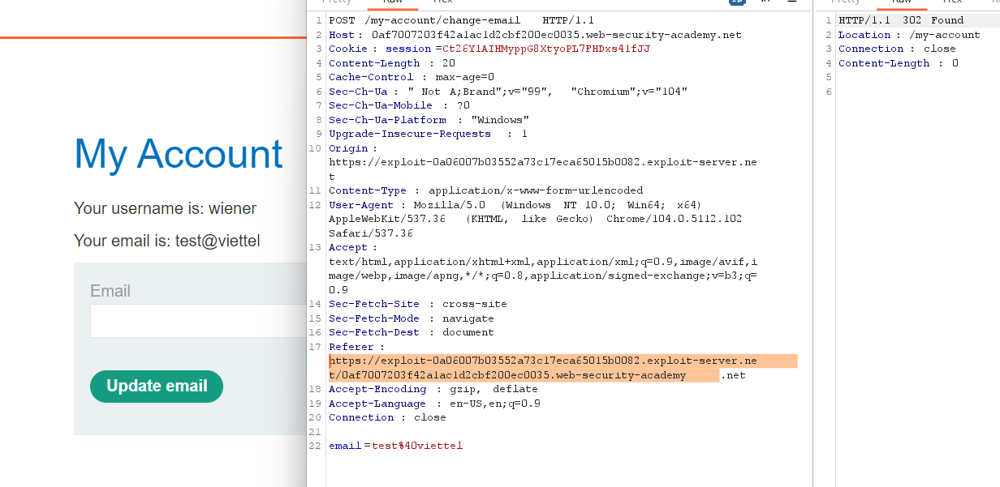

## CSRF with broken Referer validation

1. Login vào account được cấp, đổi email. Craft trang exploit nhận thấy lab này khi không có referer hay không cùng host thì đều không hợp lệ

2. Thử với giá trị referer = ``https://exploit-0a7d009c043e2d73c34b6916011d00bf.exploit-server.net/exploit/https://0aa900f804722dd5c3326a1100b2003d.web-security-academy.net/my-account`` thì thấy thành công

3.  Sử dụng thêm 