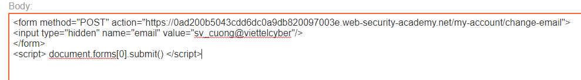
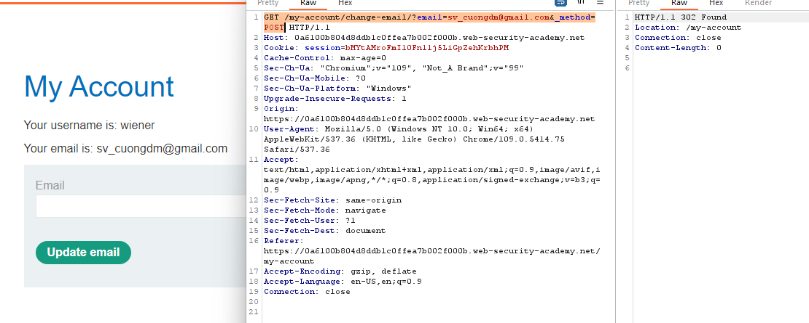
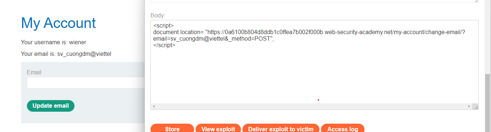

## SameSite Lax bypass via method override

1.  Khi thử chức năng đổi email trên lab, nhận thấy không có csrf token. 

2. Craft trang exploit bằng method POST thì nhận thấy request gửi đi không kèm theo session cookie của người dùng nên sẽ bị logout

3. Còn khi gửi request bằng phương thức get thì response trả về thôn báo method không được chấp nhận.

-> Từ đó + với đề bài, trong request không có set `SameSite` cookie nên khả năng cao là giá trị này đang được để mặc định (đề bài là sử dụng chrome nên mặc định SameSite có giá trị =Lax)

4. Sử dụng tham số ghi đè method `_method=POST` trong GET request thì thành công

5. Craft trang exploit

