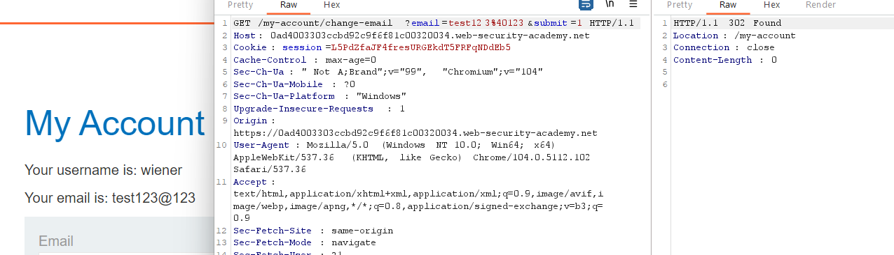
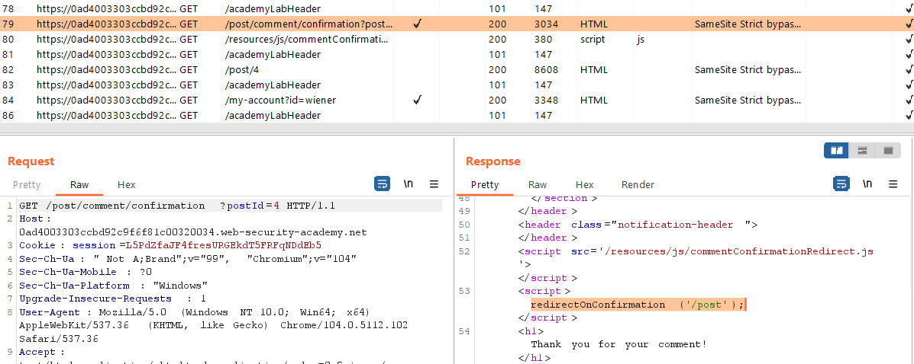
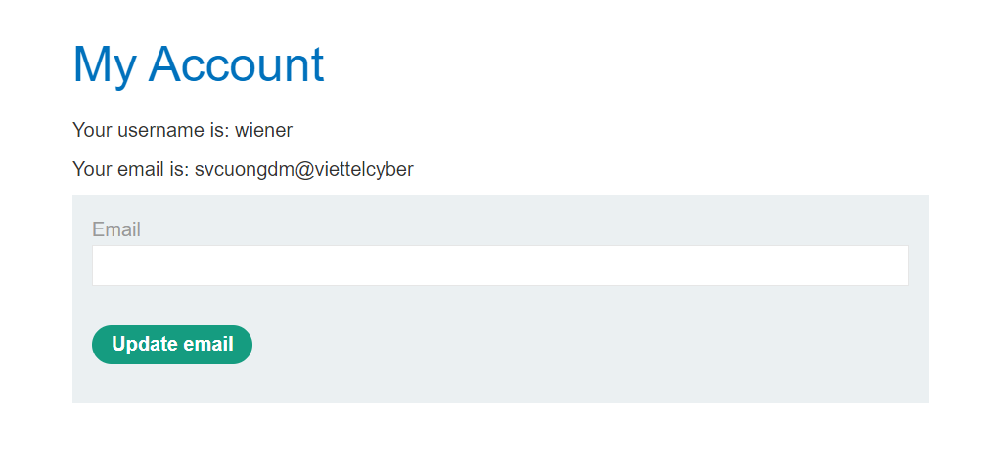
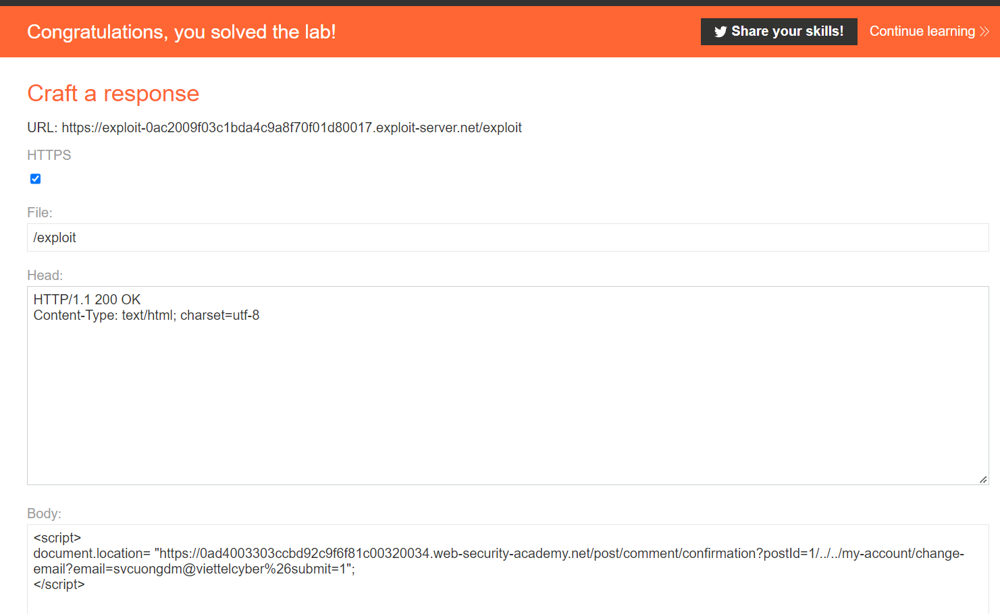

## SameSite Strict bypass via client-side redirect

1. Login vào account được cấp và thử tính năng đổi email bằng method GET thì nhận thấy thành công

2. Theo đề bài gợi ý, chúng ta tìm kiếm chức năng redirect phía client. Nhận thấy ở chức năng comment, sau khi submit chúng ta sẽ thực hiện function `redirectOnConfirmation` trong file js `commentConfirmationRedirect.js` trong resouces để redirect theo parameter postId trên url

3. Khi thử path travesal về trang my-account thì thấy thành công
- URL: ``/post/comment/confirmation?postId=4/../../my-account``

4. Khi đó ta sẽ dùng method get để đổi email với path travesal
- URL: ``/post/comment/confirmation?postId=1/../../my-account/change-email?email=svcuongdm@viettelcyber%26submit=1``

5. Craft trang exploit

