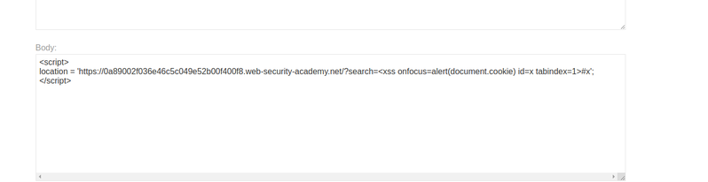

## Reflected XSS into HTML context with all tags blocked except custom ones(REFER)

1. Theo đề bài của lab, tất cả các standar tag html đều bị filter 

2. Chúng ta sẽ craft trang exploit như sau:

3. Ở đây, ta dùng location function trong js để redirect đến target với url chèn thêm payload vào giá trị của param search 
?search=<xss onfocus=alert(document.cookie) id=x tabindex=1>#x

4. Sử dụng thuộc tính id=x để gán id cho thẻ xss đồng thời đoạn cuối của url gọi đến #x để website sẽ focus vào phần từ html có id = x do đó bắt được sự kiện onfocus rồi thực thi alert lên giá trị cookie ta cần