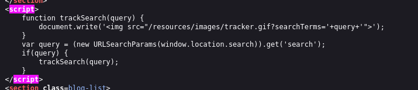
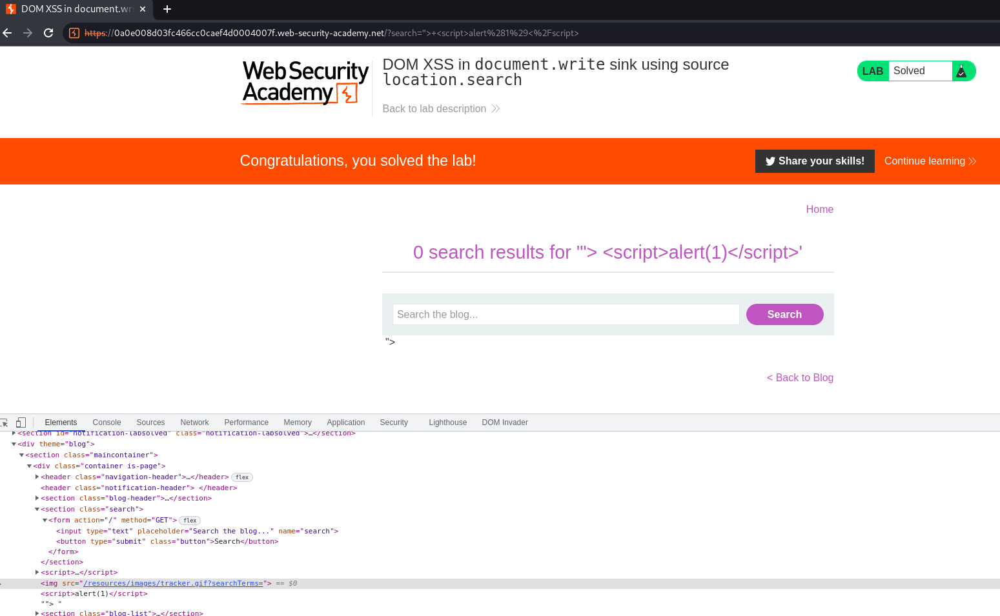

## DOM XSS in document.write sink using source location.search

1. Trong source code của trang web có đoạn mã script xử lý form 



2. Xử lý chuỗi để  hàm ``document.write()`` parse ra html có thêm thẻ ``script`` chứa xss
- Payload: ```"> <script>alert(1)</script>```

