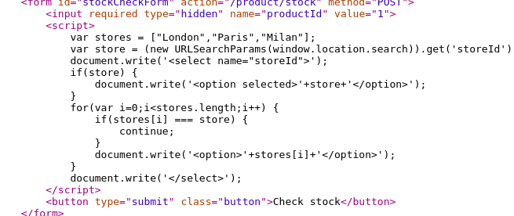
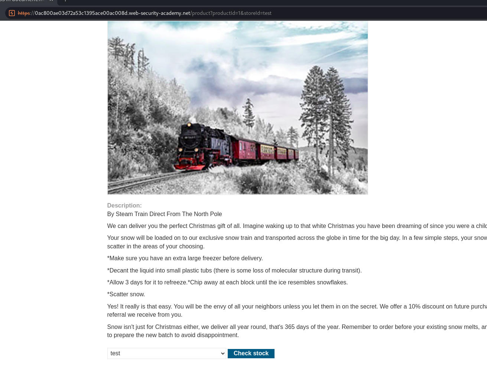
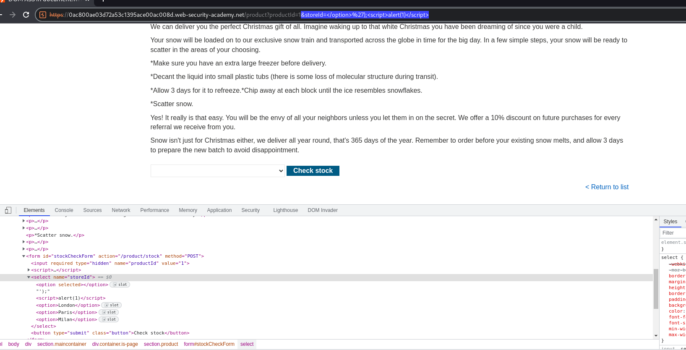

## DOM XSS in document.write sink using source location.search inside a select element

1. Trong chức năng check stock của lab, ta thấy đoạn mã xử lý generate các option trong thẻ select



2. Theo đó biến ``store`` sẽ get giá trị của tham số ``storeId`` trên url thông qua thuộc tính location.search rồi generate các option mới bằng document.write

3. Thêm giá trị cho tham số ``storeId`` với giá trị bất kỳ



4. Gửi payload 
- ```&storeId=</option>');<script>alert(1)</script>```

