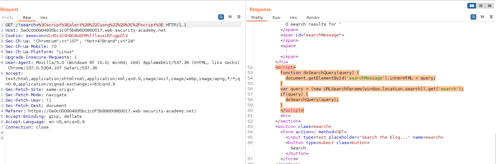
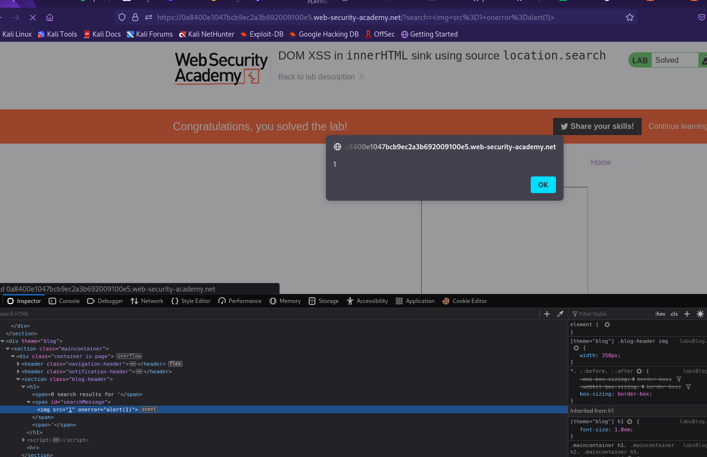

## DOM XSS in innerHTML sink using source location.search

1. Nhận thấy trong source code của website có chứa đoạn mã xử lý form phía client.



2. Input được gán vào biến query sau đó giá trị của biến query sẽ được chuyển sang html trong thẻ span có id = ``searchMessage``. 
- Payload: ``````



3. Thẻ img ở trên có giá trị của attribute ``src`` không hợp lệ nên event error bắt được và hiện lên alert() mong muốn.