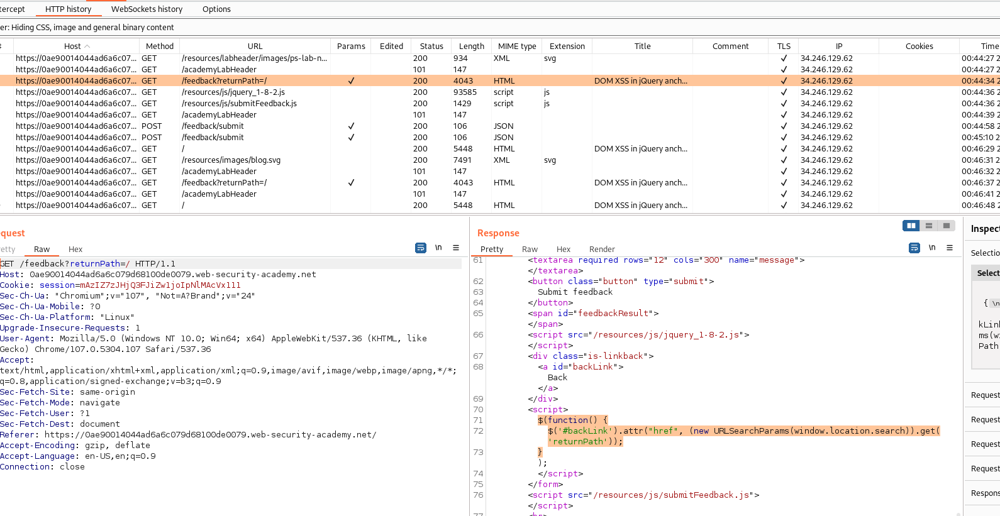

## DOM XSS in jQuery anchor href attribute sink using location.search source

1. Trong source code website ở trang submit feedback chứa đoạn mã xử lý dùng jquery



2. Theo đó, đoạn code xử lý sẽ lấy giá trị của ``returnPath`` trên url rồi gắn cho thuộc tính ``href`` trong thẻ a có id = ``backLink``

3. Theo như đề bài yêu cầu, ta sẽ làm cho button ``backLink`` sẽ trả về giá trị của ``document.cookie`` bằng cách thay đổi url để ``returnPath`` có giá trị sau: ```?returnPath=javascript:alert(document.cookie)```