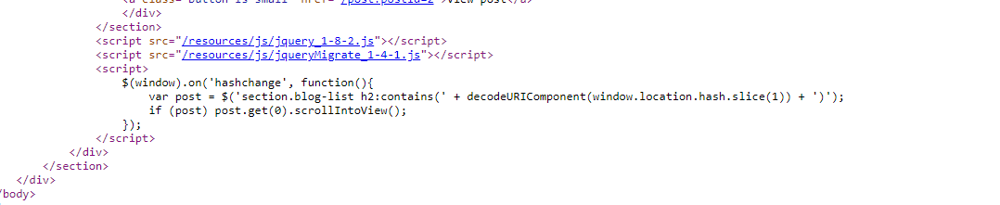

## DOM XSS in jQuery selector sink using a hashchange event

1. Trong source code của trang web có đoạn mã xử lý hashchange. Theo đó sự kiện hashchange được bắt khi fragment url bị thay đổi



2. Từ trang exploit ta có thể craft một site với response theo ý mình . Do đó ta sẽ chèn 1 thẻ iframe chứa src trang home cùng với thuộc tính onload chèn thêm payload exploit
- Payload: ```<iframe src="https://0aa300e303a9a426c137189a00d20044.web-security-academy.net/#" onload="this.src+=''">```

3. Sau khi click vào path exploit thẻ iframe tự động được gán thêm đoạn ``''`` vào sau url. Do có sự thay đổi fragment, sự kiện hashchange được bắt và render ra thẻ img chứa đoạn mã exploit