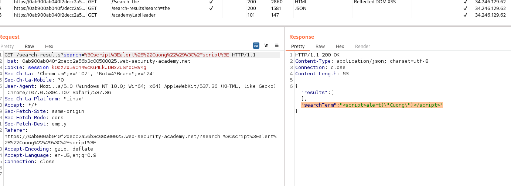
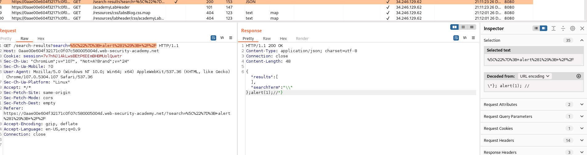

## Reflected DOM XSS

1. Thử submit input bất kỳ nhận thấy input được đưa json với giá trị của key ``searchTerm`` 



2. Sau đó được xử lý trong file ``searchResults.js``. Giá trị của input được truyền vào biến ``searchTerm`` và được parse thẳng ra thẻ h1 bằng innerHTML, do vậy ta có thể lợi dụng điều đó để inject input bằng payload
- ```"}; alert(1); //```

3. Tuy nhiên khi input chứa " khi chuyển vào json tự động escape thêm ``\``. Nên ta sẽ sửa payload thành ```\"}; alert(1); //``` để sau khi chuyển thành json thì nó trở thành 

