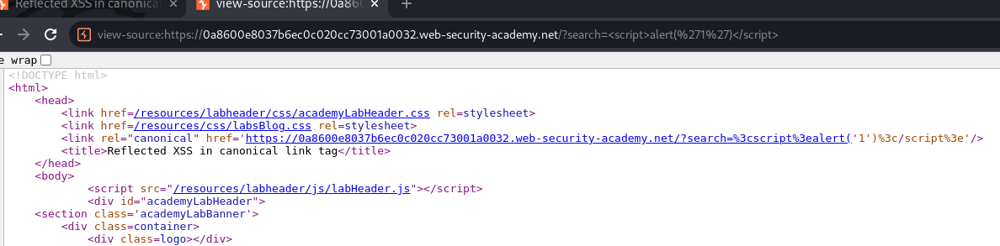
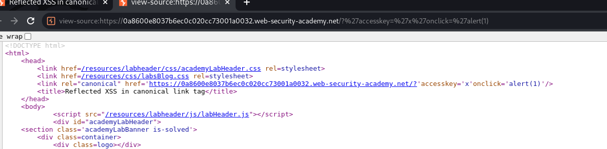

## Reflected XSS in canonical link tag

1. Theo guide, xác định được hidden input.  

2. Sau khi thử nhiều payload ta nhận ra ký tự `'` không bị mã hóa. Từ đó ta có thể tận dụng vuln này để inject accesskey attribute để có thể kích hoạt bắt event khi nhấn đúng tổ hợp phím. (Sự kiện accesskey được bắt bằng thuộc tính onclick, onfocus,... )
-Payload : ``'accesskey='x'onclick='alert(1)``

3. Sau khi ấn tổ hợp phím alt shift x thì alert hiện lên