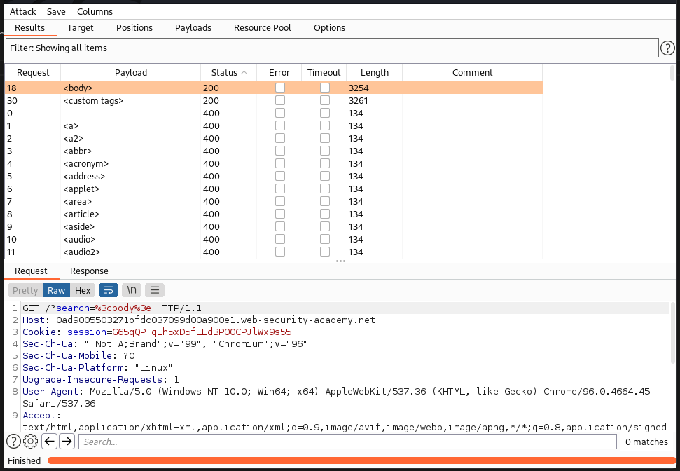
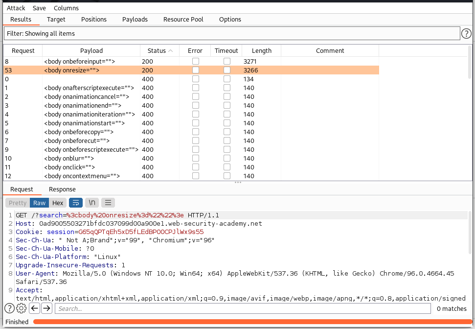
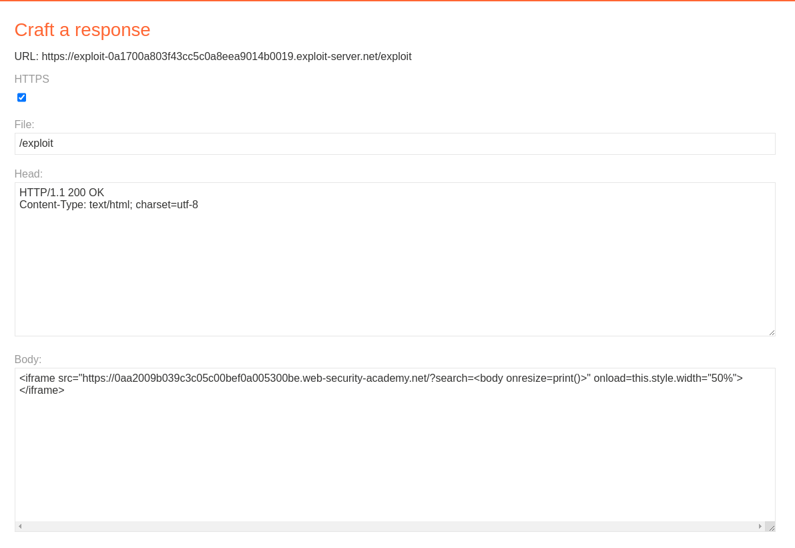

## Reflected XSS into HTML context with most tags and attributes blocked

1. Theo như đề bài, lab này triển khai WAF chặn hầu hết những atrribute và tag thông dụng.

2. Dùng Intruder để scan tất cả các tag trong html nhận thấy thẻ <body> không bị block với payload 

3. Tiếp tục dùng intruder để scan tất cả các thuộc tính bắt event kèm trong thẻ body với payload 

4. Tương tự nhận thấy thuộc tính ``onbeforeinput`` và ``onresize`` không bị blocked. Mà ở lab này chỉ có thể sử dụng thẻ body nên ta dùng ``onresize`` để khai thác. Payload ``<body onresize="print()">`` 

5. Tuy nhiên theo đề bài yêu cầu rằng chúng ta sẽ khai thác lab này mà không cần sự tác động của người dùng. Do đó ta sẽ sử dụng ifame. Trong trang `/exploit` thêm thuộc tính onload=this.style.width="50%"để event onresize bắt được ngay khi load trang web.

