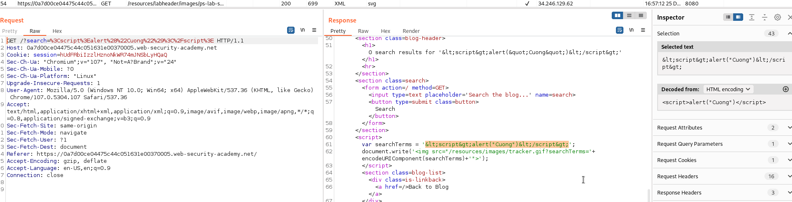
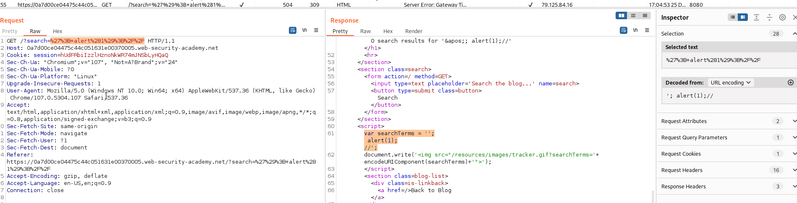

## Reflected XSS into a JavaScript string with angle brackets HTML encoded

1. Thử nhập vào input bất kỳ nhận thấy trong response input sẽ được xử  lý trong đoạn code js



2. Input sẽ được đưa vào chuỗi biến ``searchTerm``, tiến hành xử lý chuỗi.
- Payload:  ```';alert(1);//```

