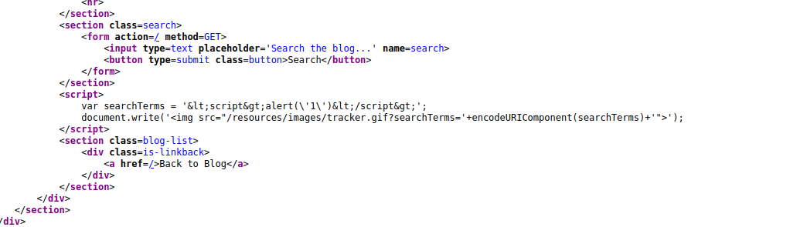
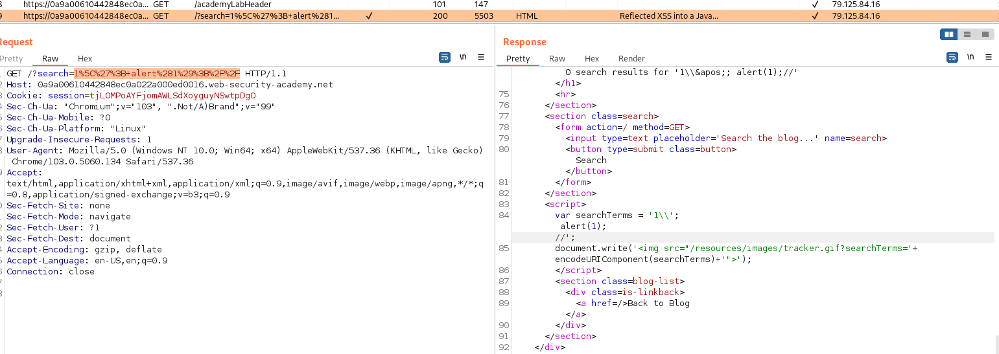

## Reflected XSS into a JavaScript string with angle brackets and double quotes HTML-encoded and single quotes escaped

1. Với đầu vào ``<script>alert('1')</script>`` trong response nhận thấy đầu vào sẽ được mã hóa ngoài ra còn escape một vài ký tự đặc biệt cụ thể bằng cách thêm `\` vào trước.



2. Ta có thể bypass bằng cách thay vì dùng `'` ta dùng `\'` để sau đó response thu được là `\\'`  làm cho `\` bị escape mà không phải `'`.
- Payload: ```1\'; alert(1); //```

