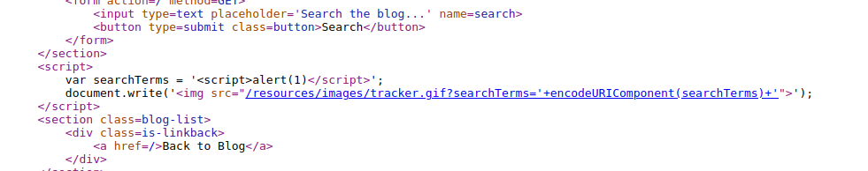
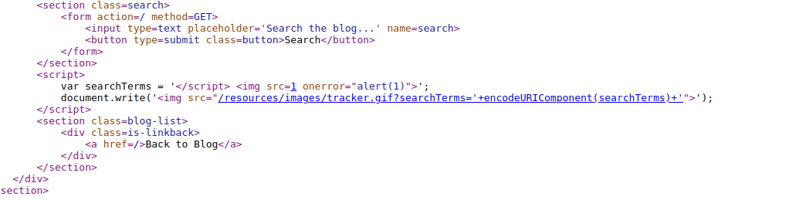

## Reflected XSS into a JavaScript string with single quote and backslash escaped

1. Nhận thấy trong source có đoạn code script xử lý chức năng search.

2. Thử với payload ``<script>alert('1')</script>`` nhận thấy thẻ scipt đóng mà không cần phải đóng khai báo chuỗi 



3. Ta có thể bypass bằng cách đóng tag </script>. Khi do phan sau se bien thanh html thuan
- Payload: ```</script> ```

