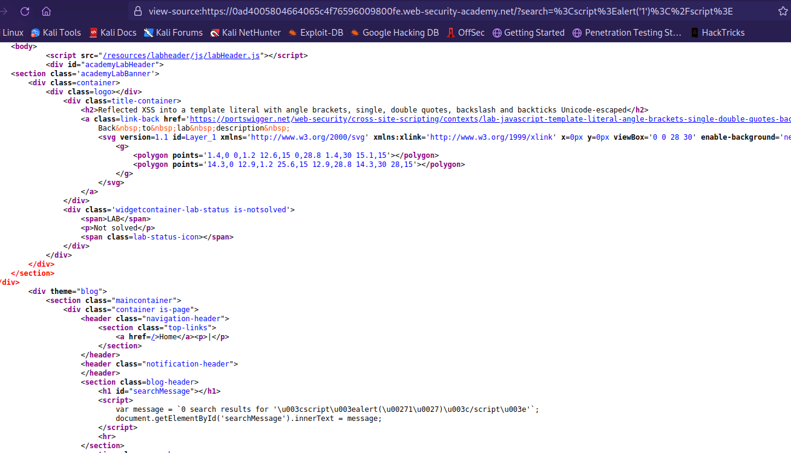
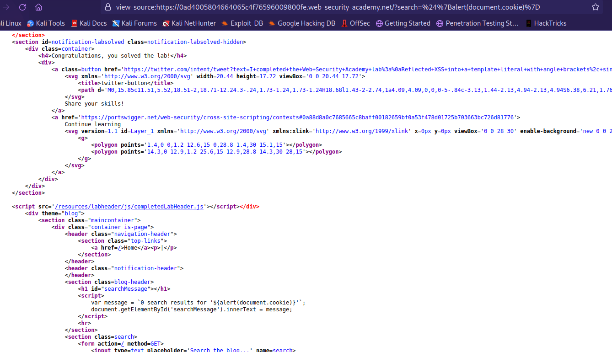

## Reflected XSS into a template literal with angle brackets, single, double quotes, backslash and backticks Unicode-escaped

1. Nhận thấy input sau khi submit sẽ được mã hóa Unicode để chống việc bypass bằng escape. Ngoài ra t còn nhận thấy đoạn xử lý js sử dụng string literal



2. Thêm template literal với payload ```${alert(document.cookie)}```

