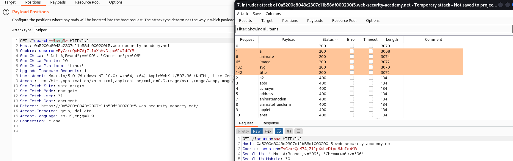

## Reflected XSS with event handlers and href attributes blocked

1. Brute-force tất cả các thẻ html để xác định những thẻ không bị block

2. Nhận được một vài thẻ html hợp lệ như : a, animate, image, svg, title

3. 