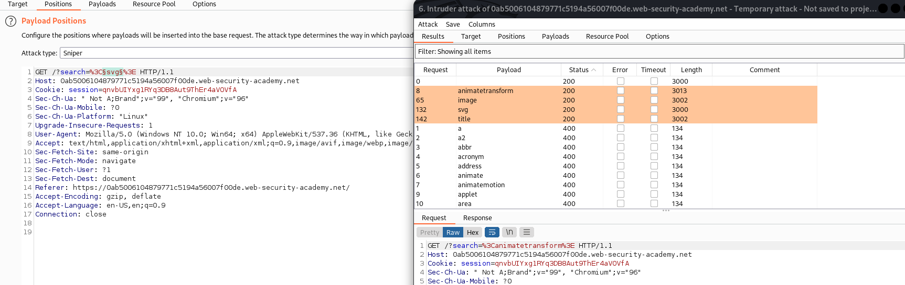
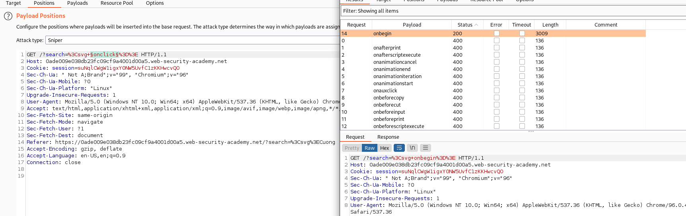

## Reflected XSS with some SVG markup allowed

1. Brute-force tất cả các thẻ html để xác định thẻ không bị block(Dùng intruder với dữ liệu trong cheat sheet)



2. Nhận được một vài thẻ không bị filter là svg, image, title, animatetransform.

3. Sau đó tiếp tục brute-force để xác định các event không bị block



4. Nhận thấy có event `onbegin` là hợp lệ. Event onbegin được kích hoạt khi một phần tử động hay animation bắt đầu thay đổi hoặc chuyển động về vị trí begin. Do đó có thể thấy thuộc tính này phù hợp với thẻ animatetransform. 
- Payload: ```<svg><animatetransform onbegin="alert(1)"></svg>```