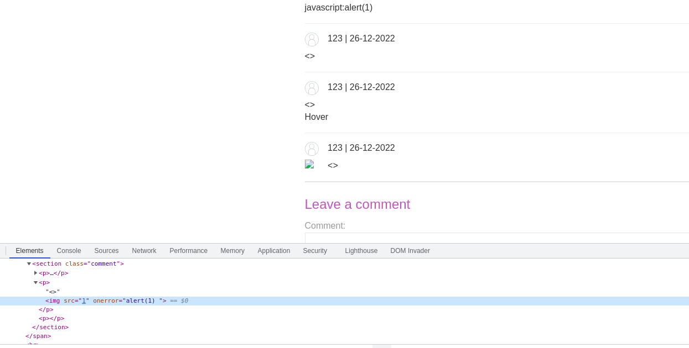

## Stored DOM XSS

1. Trang web lưu trữ dữ liệu comment trong json. Trong source code có file ``loadCommentsWithVulnerableEscapeHtml.js`` nhận thấy có hàm ``escapeHTML`` để loại bỏ các ký tự ``<``- ``>``tuy nhiên hàm replace chỉ thay đổi giá trị đầu tiên nó thấy nên ta có thể bypass nó bằng payload 
- ```<>```

