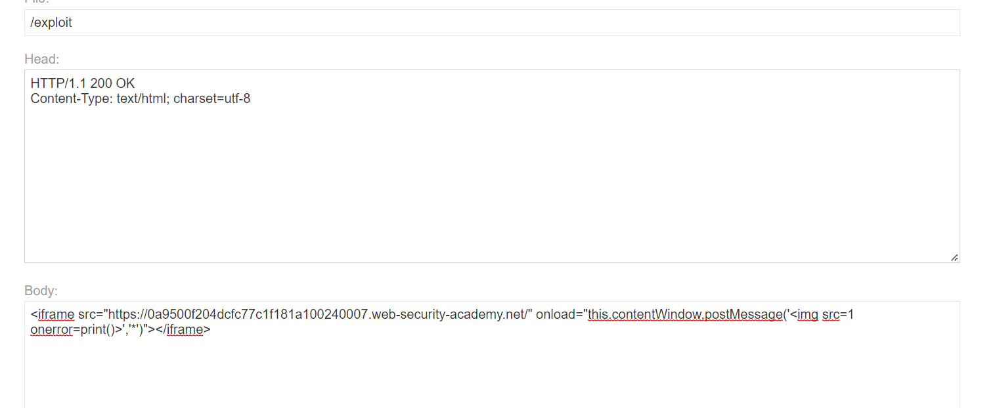

## DOM XSS using web messages

1. Nhận thấy trong source code của lab có đoạn xử lý js lấy data từ sự kiện `message` rồi gán trực tiếp cho thẻ div có id= `ads`


2. Thử gán giá trị của message event bằng postMessage() trên console
- Payload: ```window.postMessage('');```
-> Nhận thấy popup print hiện ra

3. Craft trang exploit bằng thẻ iframe. Để khi load iframe, hàm postMessage() sẽ gửi một web message đến lab. (Tham số thứ 2 của hàm postMessage() nhằm cho phép tất cả các origin)

