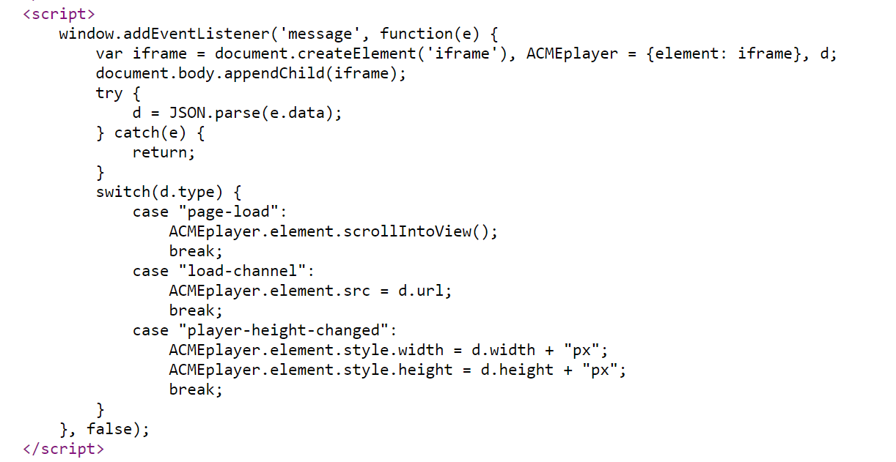

## DOM XSS using web messages and JSON.parse (REFER)

1. Nhận thấy website parse JSON từ message event. Khi xét type của biến json có giá trị `load-channel` script sẽ đổi src của iframe thành giá trị url trong JSON.



2. Craft trang exploit 

```
<iframe src=https://0a75009f03dc0c8ac328c4040046005e.web-security-academy.net/ onload='this.contentWindow.postMessage("{\"type\":\"load-channel\",\"url\":\"javascript:print()\"}","*")'>
```

3. Khi iframe được tạo load, postMessage() sẽ gửi web message đến website với type = `load-channel`. Listener event nhận được message và parse bằng JSON.parse(). Sau đó nhảy vào switch, kích hoạt trường hợp `load-channel`, trường hợp này gán thuộc tính url của message cho `src` của iframe `ACMEplayer.element`. Đặt payload thực hiện đoạn mã js cho thuộc tính url.